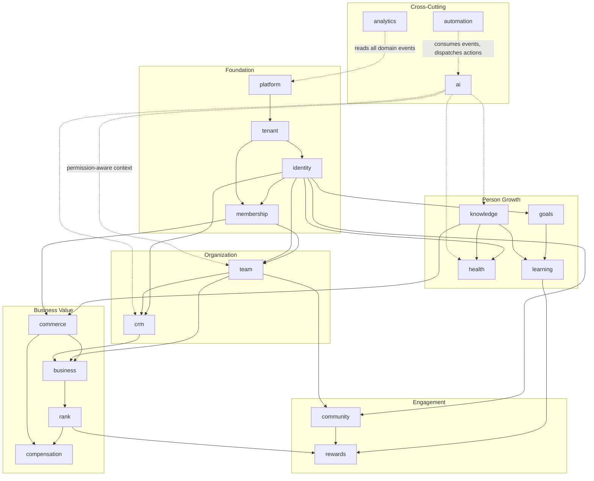

# 02 — Domain Map

> AVIORA is a **modular monolith** (spec §64) composed of 18 domains. Modules communicate through direct in-process calls (same bounded context) and **domain events** (cross-context), and must be extractable into services later without rewrites.
>
> Status: Approved · Last updated: 2026-08-19 · Source: spec §64–§66, §70–§77

---

## 1. Conventions

- **Monorepo**: pnpm workspaces + Turborepo — `apps/web` (Next.js 15 App Router, TypeScript, Tailwind, PWA, next-intl th/en), `apps/api` (NestJS 11), `packages/db` (Prisma), `packages/shared`, `docs/`, `scripts/`.
- **MVP NestJS modules** (spec §71 mapped to code): `identity`, `tenant`, `membership`, `team`, `goal`, `learning`, `crm`, `notification`, `analytics`, `ai`, `audit`, `platform`. Later-phase domains (`health`, `knowledge`, `community`, `commerce`, `business`, `rank`, `compensation`, `rewards`, `automation`) get modules when their phase begins; their contracts are reserved now.
- **Data**: PostgreSQL 17 + Prisma, snake_case tables/columns via `@map`, uuid v7 PKs, all timestamps `timestamptz`. Every tenant-owned table has `tenant_id NOT NULL` + composite indexes starting with `tenant_id`. Postgres Row-Level Security keyed on session var `app.tenant_id`.
- **Events**: PascalCase domain events (e.g. `MemberRegistered`) written to an **outbox table** in the same transaction as the state change, then relayed to **BullMQ/Redis** consumers.
- **API**: REST `/api/v1`, cursor pagination, error envelope `{error:{code,message,details,request_id}}`.
- **Phases**: MVP (spec §70–71), Phase 2 (§75), Phase 3 (§76), Phase 4 (§77).

## 2. Domain Relationship Diagram

Solid arrows = "depends on / builds upon". Dotted arrows = cross-cutting consumption (events, context). **Deliberately absent edges**: team ↛ referral, referral ↛ compensation — the Team Graph, Referral Graph, Mentor Graph, and Compensation Graph are separate structures and must never be coupled (spec §17).

## 3. The 18 Domains

### 3.1 identity

|                      |                                                                                                                                                                                                                                                                                                                                                                                          |
| -------------------- | ---------------------------------------------------------------------------------------------------------------------------------------------------------------------------------------------------------------------------------------------------------------------------------------------------------------------------------------------------------------------------------------- |
| **Purpose**          | Global authentication identity and per-tenant participation. A **User** is a global auth identity; a **Member** is that person's participation inside one tenant (spec §7). One User belongs to many tenants via TenantMembership.                                                                                                                                                       |
| **Key entities**     | `User`, `TenantMembership`, `Member`, `MemberProfile`, `Role`, `Permission`, `RolePermission`, `RefreshToken`                                                                                                                                                                                                                                                                            |
| **Key capabilities** | Register/login (Argon2id), JWT access 15 min + refresh rotation in HttpOnly cookies, tenant switcher, RBAC with scopes (`SELF`, `DIRECT_TEAM`, `DESCENDANT_TEAMS`, `SPECIFIC_TEAMS`, `TENANT_ALL`), dot-notation permission keys (`team.member.view`), custom tenant roles, MFA (Phase 2), OAuth2/OIDC & enterprise SSO (Phase 4), Member 360 profile with tenant-specific custom fields |
| **MVP**              | User, TenantMembership, Member, MemberProfile, RBAC + scopes, tenant switcher                                                                                                                                                                                                                                                                                                            |
| **Phase 2+**         | MFA (P2) · social login (P2) · enterprise SSO/SAML (P4)                                                                                                                                                                                                                                                                                                                                  |
| **Depends on**       | tenant (membership must resolve to a tenant), platform (global user registry)                                                                                                                                                                                                                                                                                                            |

### 3.2 tenant

|                      |                                                                                                                                                                                                                                                                                                                                                             |
| -------------------- | ----------------------------------------------------------------------------------------------------------------------------------------------------------------------------------------------------------------------------------------------------------------------------------------------------------------------------------------------------------- |
| **Purpose**          | The isolation boundary. Everything a tenant owns hangs off this domain (spec §4–§6).                                                                                                                                                                                                                                                                        |
| **Key entities**     | `Tenant`, `TenantSetting`, `TenantFeature` (feature flags), branding config                                                                                                                                                                                                                                                                                 |
| **Key capabilities** | Tenant CRUD (platform-admin only), TenantContext resolution — subdomain → custom domain → `X-Tenant-ID` header → JWT claim — carried via AsyncLocalStorage (nestjs-cls); tenant types (Wellness Business, Membership Club, Academy, …); settings, feature flags, default language/currency/timezone; white-label branding (logo, colors, navigation, terms) |
| **MVP**              | Tenant entity, resolution chain, TenantContext, settings, feature flags, basic branding                                                                                                                                                                                                                                                                     |
| **Phase 2+**         | Full white-label (P2) · custom domain automation (P2) · dedicated enterprise tenant DB (P4)                                                                                                                                                                                                                                                                 |
| **Depends on**       | platform (tenants are provisioned by the platform domain)                                                                                                                                                                                                                                                                                                   |

### 3.3 membership

|                      |                                                                                                                                                                                                                                                                              |
| -------------------- | ---------------------------------------------------------------------------------------------------------------------------------------------------------------------------------------------------------------------------------------------------------------------------- |
| **Purpose**          | The center of the platform. Plans, active memberships, and **entitlements** that gate capabilities — never gate by plan name (spec §8–§9).                                                                                                                                   |
| **Key entities**     | `MembershipPlan`, `Membership`, `Entitlement` (dot-notation keys: `course.access`, `ai.coach`, `community.private`, `team.create`, …)                                                                                                                                        |
| **Key capabilities** | Tenant Admin creates custom plans (Free/Basic/Premium/VIP/Partner/…/Custom); billing cycle + trial days; benefits/features/limits/eligibility rules as config; entitlement resolution: `Plan → Entitlements → Platform Capabilities`; membership activation/expiry lifecycle |
| **MVP**              | Plans, memberships, entitlement model + enforcement middleware (no payment processing — manual/free activation)                                                                                                                                                              |
| **Phase 2+**         | Paid billing + subscription renewal (P2, with commerce) · membership upgrades as rewards (P3)                                                                                                                                                                                |
| **Depends on**       | tenant, identity                                                                                                                                                                                                                                                             |

### 3.4 team

|                      |                                                                                                                                                                                                                                                                                                                                                             |
| -------------------- | ----------------------------------------------------------------------------------------------------------------------------------------------------------------------------------------------------------------------------------------------------------------------------------------------------------------------------------------------------------- |
| **Purpose**          | Team & Organization OS — unlimited teams per tenant, unlimited nesting depth, independent leadership per team (spec §11–§21).                                                                                                                                                                                                                               |
| **Key entities**     | `Team` (`parent_team_id`, root = NULL), `TeamClosure` (ancestor/descendant/depth), `TeamMembership` (member ↔ many teams; never store team_id on Member), `TeamLeadership` (`effective_from`/`effective_to`, `is_primary`), `ReferralRelationship`, `MentorRelationship`                                                                                    |
| **Key capabilities** | Create/move/merge/archive teams; assign/change leaders with effective dating; add/remove/transfer members; hierarchy queries via closure table (ancestors, descendants, siblings, depth, path); scope-aware permission checks; team dashboard splitting **direct** vs **organization** metrics; history is never destroyed — effective dates + audit events |
| **MVP**              | Full hierarchy + closure table, TeamMembership, TeamLeadership, scoped permissions, team dashboard (direct/organization member counts, goals, learning)                                                                                                                                                                                                     |
| **Phase 2+**         | Team communities auto-provisioning (P2) · referral graph activation (P3) · advanced org analytics (P3)                                                                                                                                                                                                                                                      |
| **Depends on**       | tenant, identity, membership (entitlements like `team.create`)                                                                                                                                                                                                                                                                                              |
| **Hard rule**        | Team Graph ≠ Referral Graph ≠ Compensation Graph ≠ Mentor Graph — separate tables, separate lifecycles, never coupled (spec §17).                                                                                                                                                                                                                           |

### 3.5 goals

|                      |                                                                                                                                                                                                                                                                                                             |
| -------------------- | ----------------------------------------------------------------------------------------------------------------------------------------------------------------------------------------------------------------------------------------------------------------------------------------------------------- |
| **Purpose**          | Dream OS + goal setting + task/activity engine (spec §22, §26).                                                                                                                                                                                                                                             |
| **Key entities**     | `Goal`, `Dream`, `Habit`, `Task`, `Activity`, `Checklist`, `Milestone`, `JournalEntry`                                                                                                                                                                                                                      |
| **Key capabilities** | 100 Dreams / vision board; goal categories (life, family, financial, travel, health, learning, business); annual/quarterly/monthly cadences; milestones; journal & reflection; personal/team/course/business/health/community tasks; recurring tasks (daily/weekly/monthly); AI Dream Coach (via ai domain) |
| **MVP**              | Goals + dreams CRUD, milestones, basic tasks, goal progress on dashboard                                                                                                                                                                                                                                    |
| **Phase 2+**         | Habits & streaks with gamification (P2) · AI Dream Coach (P2) · team goal cascading (P3)                                                                                                                                                                                                                    |
| **Depends on**       | tenant, identity; team (team goals)                                                                                                                                                                                                                                                                         |

### 3.6 health

|                      |                                                                                                                                                                                                                                                                                                                                |
| -------------------- | ------------------------------------------------------------------------------------------------------------------------------------------------------------------------------------------------------------------------------------------------------------------------------------------------------------------------------ |
| **Purpose**          | Healthy Living OS — wellness value before commerce (spec §27–§28). Education and tracking; **never diagnosis, never unsupported medical claims**; safety context on all recommendations.                                                                                                                                       |
| **Key entities**     | `HealthGoal`, `HealthProfile`, `HabitLog`, `WellnessScore`, lifestyle/nutrition/exercise/sleep/hydration/weight/supplement tracking entities                                                                                                                                                                                   |
| **Key capabilities** | Healthy living goals & journeys, lifestyle profile, habit/supplement tracking, wellness score, progress, AI Healthy Living Coach; **strong privacy**: dedicated permissions (`health.profile.view/edit`, `health.coach.view`) — health data is invisible to team leaders unless the member explicitly grants access (spec §59) |
| **MVP**              | Out — except `HealthGoal` as a knowledge-graph anchor entity used by Slice 3 (goal taxonomy only, no tracking)                                                                                                                                                                                                                 |
| **Phase 2+**         | Full tracking + wellness score + AI coach (P2) · advanced health & wearables (explicitly post-MVP; wearables P4)                                                                                                                                                                                                               |
| **Depends on**       | tenant, identity, knowledge (health goals link into the knowledge graph)                                                                                                                                                                                                                                                       |

### 3.7 knowledge

|                      |                                                                                                                                                                                                                                                                                                                                                                  |
| -------------------- | ---------------------------------------------------------------------------------------------------------------------------------------------------------------------------------------------------------------------------------------------------------------------------------------------------------------------------------------------------------------- |
| **Purpose**          | Knowledge OS + knowledge graph + Product Intelligence content side: `Health Goal → Topic → Body System → Lifestyle → Nutrition → Food → Ingredient → Evidence → Product`. Product is never the beginning of the journey (spec §28–§33).                                                                                                                          |
| **Key entities**     | `HealthGoal`, `Topic`, `Ingredient`, `Food`, `Lifestyle`, `Article`, `EvidenceReference`, `KnowledgeCard`, mapping tables (`HealthGoal↔Topic`, `Topic↔Ingredient`, `Ingredient↔Product`, `Article↔{Topic,Ingredient,Product}`, `Ingredient↔Evidence`)                                                                                                            |
| **Key capabilities** | Three knowledge scopes: Global / Tenant / Private; content types (article, video, podcast, infographic, guide, FAQ, knowledge card); content mapped to goals/topics/ingredients/products/teams/memberships/learning paths; search that ranks knowledge before products; RAG source for the ai domain with **authorization enforced before retrieval** (spec §50) |
| **MVP**              | Minimal read-path for Slice 3: HealthGoal, Topic, Article, Ingredient + mappings and a knowledge browse/search screen                                                                                                                                                                                                                                            |
| **Phase 2+**         | Full knowledge graph + AI search + content recommendation (P2)                                                                                                                                                                                                                                                                                                   |
| **Depends on**       | tenant; commerce (product links, one-directional: knowledge → product)                                                                                                                                                                                                                                                                                           |

### 3.8 learning

|                      |                                                                                                                                                                                                                         |
| -------------------- | ----------------------------------------------------------------------------------------------------------------------------------------------------------------------------------------------------------------------- |
| **Purpose**          | Learning OS / LMS (spec §24). Education before promotion.                                                                                                                                                               |
| **Key entities**     | `Course`, `LearningPath`, `Lesson`, `Quiz`, `Assessment`, `Certification`, `LearningProgress`, `LiveClass`, `Event`, `Attendance`                                                                                       |
| **Key capabilities** | Courses with video/audio/document lessons; quizzes & assessments; certifications; live classes & attendance; progress tracking; assignment by tenant / membership / role / team / rank / country / individual; AI Tutor |
| **MVP**              | Course + Lesson + LearningProgress, assignment to member/team, progress on dashboards                                                                                                                                   |
| **Phase 2+**         | Quizzes, certifications, learning paths (P2) · live classes/events (P2) · AI Tutor (P2) · rank-gated learning (P3)                                                                                                      |
| **Depends on**       | tenant, identity, membership (entitlement `course.access`); team (team assignment); knowledge (courses are content)                                                                                                     |

### 3.9 crm

|                      |                                                                                                                                                                                                                                                                                 |
| -------------------- | ------------------------------------------------------------------------------------------------------------------------------------------------------------------------------------------------------------------------------------------------------------------------------- |
| **Purpose**          | Customer OS — each member manages their own leads, prospects, and customers through a tenant-configurable pipeline (spec §34–§35).                                                                                                                                              |
| **Key entities**     | `Lead`, `Prospect`, `Customer`, `Contact`, `Opportunity`, `FollowUp`, `Interaction`, `Note`, `Tag`, `Segment`, `PipelineStage` (config)                                                                                                                                         |
| **Key capabilities** | Configurable pipeline (e.g. Lead → Contacted → Interested → Presentation → Follow-up → Customer → Member → Partner); follow-up scheduling; interaction log; tagging & segmentation; AI CRM (lead priority, next best action, follow-up drafting, inactive detection) in Phase 2 |
| **MVP**              | Leads, customers, pipeline stages (config), follow-ups, basic interaction notes                                                                                                                                                                                                 |
| **Phase 2+**         | AI CRM suite, segmentation, content/product recommendation to customers (P2) · conversion analytics feeding business KPIs (P3)                                                                                                                                                  |
| **Depends on**       | tenant, identity; team (team-scoped CRM visibility for leaders)                                                                                                                                                                                                                 |

### 3.10 community

|                      |                                                                                                                                                                                                                                                                            |
| -------------------- | -------------------------------------------------------------------------------------------------------------------------------------------------------------------------------------------------------------------------------------------------------------------------- |
| **Purpose**          | Community OS — community before network (spec §36–§38).                                                                                                                                                                                                                    |
| **Key entities**     | `Community`, `Group`, `Post`, `Comment`, `Reaction`, `Challenge`, `ChallengeParticipation`, `Poll`, `Announcement`, `Leaderboard`, gamification (`XP`, `Level`, `Badge`, `Achievement`, `Streak`, `Mission`)                                                               |
| **Key capabilities** | Feeds, posts, comments, reactions; team communities (each team may auto-get a private community) and topic communities; events; challenge engine (health/learning/business/community/team challenges); recognition & leaderboards; configuration-driven gamification rules |
| **MVP**              | Out entirely                                                                                                                                                                                                                                                               |
| **Phase 2+**         | Feed, groups, challenges, gamification (P2)                                                                                                                                                                                                                                |
| **Depends on**       | tenant, identity, team; rewards (challenge rewards)                                                                                                                                                                                                                        |

### 3.11 commerce

|                      |                                                                                                                                                                                                                                                                                                                                                                                                        |
| -------------------- | ------------------------------------------------------------------------------------------------------------------------------------------------------------------------------------------------------------------------------------------------------------------------------------------------------------------------------------------------------------------------------------------------------ |
| **Purpose**          | Commerce OS — supports the journey, never leads it (spec §39–§40). Brand-neutral product catalog with Product Intelligence.                                                                                                                                                                                                                                                                            |
| **Key entities**     | `Brand`, `Product`, `ProductIngredient`, `ProductMapping`, `Order`, `OrderItem`, `Subscription`, `Cart`, `Coupon`, `Bundle`, `PriceRule`                                                                                                                                                                                                                                                               |
| **Key capabilities** | Catalog with Product Intelligence (ingredients, health goals, topics, evidence context, source URL, last verified, safety notes, alternatives, community experience); membership pricing & discounts; cart/checkout; generic recurring engine (monthly/quarterly/custom, pause/skip/resume/cancel, auto-renewal) not tied to any product program; external product & affiliate links; marketplace (P4) |
| **MVP**              | Out — except read-only `Brand`/`Product`/`ProductIngredient` needed for Slice 3 knowledge-to-product journey (no cart, no checkout, no payments)                                                                                                                                                                                                                                                       |
| **Phase 2+**         | Catalog, cart, checkout, subscriptions, membership pricing (P2) · multi-brand marketplace (P4)                                                                                                                                                                                                                                                                                                         |
| **Depends on**       | tenant, membership (member pricing), knowledge (ingredient/goal mappings)                                                                                                                                                                                                                                                                                                                              |
| **Hard rule**        | Adding a second brand must require zero schema changes (spec §31).                                                                                                                                                                                                                                                                                                                                     |

### 3.12 business

|                      |                                                                                                                                                                                                    |
| -------------------- | -------------------------------------------------------------------------------------------------------------------------------------------------------------------------------------------------- |
| **Purpose**          | Business OS — tooling for members who build a business: prospecting, conversion, activation, team building, KPIs (spec §41).                                                                       |
| **Key entities**     | `BusinessKPI`, `ActivationRecord`, `PresentationAsset`, views/aggregates over crm + team + commerce                                                                                                |
| **Key capabilities** | Prospecting workflows, presentation/follow-up tooling, member & partner activation tracking, organization growth metrics, business KPI dashboards; feeds the rank engine with qualification inputs |
| **MVP**              | Out (basic dashboard counts live in analytics)                                                                                                                                                     |
| **Phase 2+**         | Business tooling (P2–P3) · leadership journey (P3)                                                                                                                                                 |
| **Depends on**       | crm, team, commerce, learning                                                                                                                                                                      |

### 3.13 rank

|                      |                                                                                                                                                                                                                              |
| -------------------- | ---------------------------------------------------------------------------------------------------------------------------------------------------------------------------------------------------------------------------- |
| **Purpose**          | Rank Engine — configurable progression definitions and qualification tracking (spec §44).                                                                                                                                    |
| **Key entities**     | `RankDefinition`, `RankQualification`, `RankProgress`, `RankHistory`, `RankAchievement`, `RankRequalification`                                                                                                               |
| **Key capabilities** | Tenant-defined ranks (never hard-coded); qualification rules; progress dashboard: current rank → next rank → progress → missing requirements → potential reward → recommended learning; requalification cycles; full history |
| **MVP**              | Out                                                                                                                                                                                                                          |
| **Phase 2+**         | Rank engine (P3)                                                                                                                                                                                                             |
| **Depends on**       | tenant, business (qualification inputs), team, learning; feeds rewards and compensation                                                                                                                                      |

### 3.14 compensation

|                      |                                                                                                                                                                                                                                                                                         |
| -------------------- | --------------------------------------------------------------------------------------------------------------------------------------------------------------------------------------------------------------------------------------------------------------------------------------- |
| **Purpose**          | Compensation OS — **optional per tenant**, entirely rule-engine driven, never one hard-coded network plan (spec §42–§43).                                                                                                                                                               |
| **Key entities**     | `CompensationPlan`, `QualificationRule`, `RankRule`, `VolumeRule`, `LegRule`, `BonusRule`, `GrowthRule`, `MilestoneRule`, `CommissionRule`, `PaymentRule`, `RewardRule`, `Commission`, compensation graph edges (separate from team/referral graphs)                                    |
| **Key capabilities** | Declarative rule engine (`IF rank >= X AND personal_volume >= Y AND qualified_legs >= Z THEN reward = formula`); bonus types (fixed, percentage, milestone, rank, leadership, growth, matching, referral, team, requalification, come-back); commission calculation runs; payment rules |
| **MVP**              | Out — explicitly excluded (spec §71)                                                                                                                                                                                                                                                    |
| **Phase 2+**         | Full compensation rule engine (P3)                                                                                                                                                                                                                                                      |
| **Depends on**       | tenant, rank, commerce (volumes), its own compensation graph — **never** reads team or referral graphs as its structure                                                                                                                                                                 |

### 3.15 rewards

|                      |                                                                                                                                                                                 |
| -------------------- | ------------------------------------------------------------------------------------------------------------------------------------------------------------------------------- |
| **Purpose**          | Reward OS — recognition and non-monetary (and monetary) rewards, **separate from commission** (spec §45).                                                                       |
| **Key entities**     | `Reward`, `RewardGrant`, `Achievement`, `Certificate`, `PointsLedger`                                                                                                           |
| **Key capabilities** | Reward types: cash, points, badge, product, coupon, membership upgrade, course access, event ticket, recognition, certificate; grant/redeem flows; recognition feed integration |
| **MVP**              | Out                                                                                                                                                                             |
| **Phase 2+**         | Points/badges with gamification (P2) · full reward engine (P3)                                                                                                                  |
| **Depends on**       | tenant; triggered by rank, learning, community, automation                                                                                                                      |

### 3.16 automation

|                      |                                                                                                                                                                                                                                                                                                                                                                     |
| -------------------- | ------------------------------------------------------------------------------------------------------------------------------------------------------------------------------------------------------------------------------------------------------------------------------------------------------------------------------------------------------------------- |
| **Purpose**          | Automation OS — trigger-action workflow engine over domain events (spec §51).                                                                                                                                                                                                                                                                                       |
| **Key entities**     | `Automation`, `AutomationTrigger`, `AutomationAction`, `AutomationRun`                                                                                                                                                                                                                                                                                              |
| **Key capabilities** | Triggers: `member.created`, `member.inactive`, `membership.expiring`, `goal.completed`, `course.completed`, `rank.achieved`, `order.completed`, `subscription.failed`, … Actions: `send_notification`, `send_email`, `send_line`, `create_task`, `assign_course`, `assign_coach`, `grant_reward`, `update_segment`, `run_ai`, `create_followup`, `trigger_workflow` |
| **MVP**              | Out as a user-facing builder ("complex automation" excluded). The **event backbone** (outbox + BullMQ) ships in MVP and is what automation later consumes; MVP notifications hook directly onto events.                                                                                                                                                             |
| **Phase 2+**         | Simple recipes (P2) · advanced automation builder (P3)                                                                                                                                                                                                                                                                                                              |
| **Depends on**       | event backbone (all domains), notification, ai, rewards, learning, crm                                                                                                                                                                                                                                                                                              |

### 3.17 ai

|                      |                                                                                                                                                                                                                                                                                                                                                                                                                                                                                                                                                                         |
| -------------------- | ----------------------------------------------------------------------------------------------------------------------------------------------------------------------------------------------------------------------------------------------------------------------------------------------------------------------------------------------------------------------------------------------------------------------------------------------------------------------------------------------------------------------------------------------------------------------- |
| **Purpose**          | AI OS — centralized, provider-agnostic AI Gateway; AI assists people, never replaces human responsibility (spec §46–§50).                                                                                                                                                                                                                                                                                                                                                                                                                                               |
| **Key entities**     | `AIConversation`, `AIMessage`, `AIUsage` (per-tenant token/cost tracking), agent configs, RAG index metadata                                                                                                                                                                                                                                                                                                                                                                                                                                                            |
| **Key capabilities** | Architecture `Application → AI Gateway → Model Router → Provider` (Anthropic adapter first; OpenAI/Gemini later — no domain code touches a provider SDK); **permission-aware context assembly**: tenant + user + member + team scope + role/permissions + entitlements + knowledge + business rules; logical agents (Healthy Living Coach, Knowledge Assistant, Learning Coach, Business Coach, CRM Assistant, Team Coach, …); RAG with authorization **before** retrieval — unauthorized content is never fetched then filtered; AI usage & cost monitoring per tenant |
| **MVP**              | AI Gateway + Anthropic adapter, one Basic AI Assistant (member Q&A over allowed knowledge + own data), AIConversation/AIUsage tracking, permission tests                                                                                                                                                                                                                                                                                                                                                                                                                |
| **Phase 2+**         | AI Search, AI CRM, content recommendation (P2) · AI Team Coach, AI Leadership Coach (P3) · advanced agents (P4)                                                                                                                                                                                                                                                                                                                                                                                                                                                         |
| **Depends on**       | tenant, identity (permissions), membership (entitlement `ai.coach`), team (scope), knowledge (RAG)                                                                                                                                                                                                                                                                                                                                                                                                                                                                      |

### 3.18 analytics

|                      |                                                                                                                                                                                                                                                                                                                                                                                                          |
| -------------------- | -------------------------------------------------------------------------------------------------------------------------------------------------------------------------------------------------------------------------------------------------------------------------------------------------------------------------------------------------------------------------------------------------------- |
| **Purpose**          | Analytics OS — dashboards at member, team/leader, tenant, and platform levels (spec §53).                                                                                                                                                                                                                                                                                                                |
| **Key entities**     | Metric aggregate tables / materialized views, `AnalyticsEvent` projections from the event stream                                                                                                                                                                                                                                                                                                         |
| **Key capabilities** | Member dashboard (goal, health, learning, community, business, rewards); Leader dashboard (team growth, engagement, new/active members, customers, learning, sales, goals) with **direct vs organization** separation and drill-down; Tenant dashboard (members, retention, membership revenue, engagement, AI usage, churn); Platform dashboard (tenants, MRR/ARR, churn, AI cost, storage, infra cost) |
| **MVP**              | Member dashboard (goals, learning), team dashboard (direct/org member counts, learning progress), tenant admin counts, platform tenant counts                                                                                                                                                                                                                                                            |
| **Phase 2+**         | Engagement/commerce metrics (P2) · advanced analytics + correlations (P3)                                                                                                                                                                                                                                                                                                                                |
| **Depends on**       | consumes events from every domain; platform (billing metrics)                                                                                                                                                                                                                                                                                                                                            |

### 3.19 platform

|                      |                                                                                                                                                                                                           |
| -------------------- | --------------------------------------------------------------------------------------------------------------------------------------------------------------------------------------------------------- |
| **Purpose**          | Platform operations — the layer above all tenants (spec §53 platform dashboard, §57 platform roles).                                                                                                      |
| **Key entities**     | `PlatformUser` roles (Platform Owner, Super Admin, Support, Finance, Analyst), `SubscriptionPlan` (tenant-level SaaS plans), platform `AuditLog`, usage/billing records                                   |
| **Key capabilities** | Tenant provisioning & lifecycle; platform roles; SaaS plan management; cross-tenant operational dashboards (never exposing tenant private business data beyond operational metrics); platform-level audit |
| **MVP**              | Platform admin app section: create/configure tenants, create tenant owner, tenant list, basic platform dashboard                                                                                          |
| **Phase 2+**         | Tenant billing (P2) · partner portal, API marketplace (P4)                                                                                                                                                |
| **Depends on**       | none (root of the dependency graph); audit, analytics consume from it                                                                                                                                     |

> **audit** (cross-cutting, MVP module): `AuditLog{tenant, user, member, action, entity, before, after, timestamp, ip, device, request_id}` (spec §60). Audits all sensitive operations — membership, team, leader changes, rank, compensation, payment, health, permissions, tenant configuration. Implemented as a NestJS module consuming domain events + explicit audit calls; listed here rather than as a 19th business domain.

## 4. Phase Summary Matrix

| Domain       |             MVP              |          Phase 2          |           Phase 3           |             Phase 4             |
| ------------ | :--------------------------: | :-----------------------: | :-------------------------: | :-----------------------------: |
| identity     |           ✅ core            |     MFA, social login     |              —              |         Enterprise SSO          |
| tenant       |           ✅ core            |        white-label        |              —              |       dedicated tenant DB       |
| membership   |     ✅ core (no billing)     |      billing/renewal      |       reward upgrades       |                —                |
| team         |      ✅ full hierarchy       |     team communities      |    referral graph active    |                —                |
| goals        |    ✅ goals/dreams/tasks     |     habits, AI coach      |       team cascading        |                —                |
| health       |     anchor entities only     |          ✅ full          |              —              |            wearables            |
| knowledge    |      Slice-3 read path       | ✅ full graph + AI search |              —              |                —                |
| learning     |     ✅ courses/progress      |   quizzes, certs, paths   |         rank-gated          |                —                |
| crm          |      ✅ leads/follow-up      |          AI CRM           |    conversion analytics     |                —                |
| community    |              —               |  ✅ full + gamification   |              —              |                —                |
| commerce     |  Slice-3 read-only catalog   |   ✅ cart/checkout/subs   |              —              |           marketplace           |
| business     |              —               |          tooling          | ✅ KPIs, leadership journey |                —                |
| rank         |              —               |             —             |             ✅              |                —                |
| compensation |              —               |             —             |             ✅              |                —                |
| rewards      |              —               |       points/badges       |       ✅ full engine        |                —                |
| automation   |     event backbone only      |      simple recipes       |     ✅ advanced builder     |                —                |
| ai           | ✅ gateway + basic assistant |     search, CRM, recs     |    team/leadership coach    |         advanced agents         |
| analytics    |     ✅ basic dashboards      |    engagement/commerce    |          advanced           |                —                |
| platform     |    ✅ tenant provisioning    |      tenant billing       |              —              | partner portal, API marketplace |

## 5. Inter-Domain Communication Rules

1. **Within a module**: direct service calls.
2. **Across modules, synchronous need** (e.g. permission check, entitlement check): call the owning module's public service interface — never its repositories or Prisma models directly.
3. **Across modules, reactive need** (e.g. dashboard update, notification, audit): domain events via outbox → BullMQ. Consumers must be idempotent.
4. **Forbidden couplings**: team ↔ referral ↔ compensation graphs; any domain ↔ AI provider SDK (only the ai module's gateway touches providers); any domain reading another domain's tables.
5. **Everything receives TenantContext** — no domain service executes without a resolved tenant (platform domain excepted for cross-tenant operations, which require platform roles).
