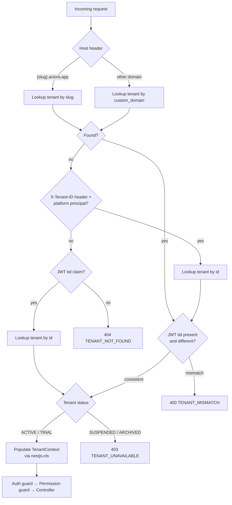
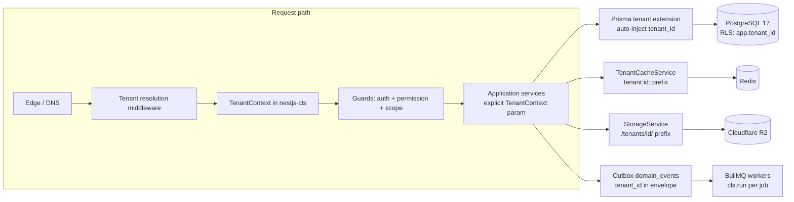
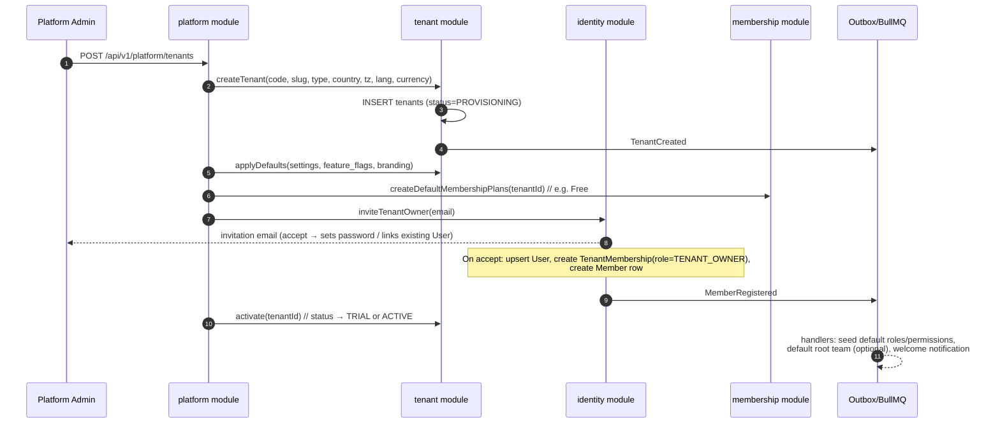

# 03 — Multi-Tenant Architecture

> **Project:** AVIORA · **Date:** 2026-08-19 · **Status:** Accepted
> Depends on: [00-architecture-assessment.md](./00-architecture-assessment.md)
> Golden rule (spec §69): **Tenant A must never access Tenant B data.** Every design in this document exists to make that statement enforceable by machinery, not discipline.

---

## 1. Tenant model

### 1.1 Tenant entity

Platform-scope table (no `tenant_id` on itself; exempt from RLS).

```prisma
model Tenant {
  id                 String    @id @default(dbgenerated("uuid_generate_v7()")) @db.Uuid
  code               String    @unique                      // short immutable code, e.g. "AVR-0001"
  name               String
  slug               String    @unique                      // subdomain: {slug}.aviora.app
  legalName          String?   @map("legal_name")
  tenantType         TenantType @map("tenant_type")
  status             TenantStatus @default(PROVISIONING)
  logoUrl            String?   @map("logo_url")
  primaryDomain      String?   @unique @map("primary_domain")   // e.g. acme.aviora.app (denormalized)
  customDomain       String?   @unique @map("custom_domain")    // e.g. members.acme.com
  country            String    @db.Char(2)                  // ISO 3166-1 alpha-2
  timezone           String    @default("Asia/Bangkok")
  defaultLanguage    String    @default("th") @map("default_language")
  defaultCurrency    String    @default("THB") @db.Char(3) @map("default_currency")
  subscriptionPlanId String?   @map("subscription_plan_id") @db.Uuid
  branding           Json      @default("{}")               // colors, fonts, app name, email branding
  settings           Json      @default("{}")               // tenant-configurable behavior
  featureFlags       Json      @default("{}") @map("feature_flags")
  metadata           Json      @default("{}")
  createdAt          DateTime  @default(now()) @map("created_at") @db.Timestamptz(6)
  updatedAt          DateTime  @updatedAt @map("updated_at") @db.Timestamptz(6)

  @@map("tenants")
}
```

### 1.2 Tenant types and status

```
TenantType:   WELLNESS_BUSINESS | MEMBERSHIP_CLUB | NETWORK_COMMUNITY | COACHING_ORG |
              AFFILIATE_ORG | DIRECT_SELLING_ORG | ACADEMY | CORPORATE_WELLNESS |
              CREATOR_COMMUNITY | RETAIL_MEMBERSHIP | HYBRID
TenantStatus: PROVISIONING | TRIAL | ACTIVE | SUSPENDED | ARCHIVED
```

Tenant type is descriptive/analytic; it must never gate features directly (feature gating goes through `featureFlags` + plan entitlements — spec §31 brand-neutrality logic applies to tenant types too).

---

## 2. Tenant resolution chain

Resolution runs in NestJS middleware, before guards. Precedence (first match wins), then **consistency check** against any other signals present:

```
1. Subdomain        {slug}.aviora.app          → lookup by slug           (cached)
2. Custom domain    members.acme.com           → lookup by custom_domain  (cached)
3. X-Tenant-ID      header (internal/API keys) → lookup by id             (service-to-service, platform admin tools)
4. JWT claim        tid claim in access token  → fallback / verification
```

Rules:

- If both a host-derived tenant and a JWT `tid` are present and **disagree** → `400 TENANT_MISMATCH`. Never silently prefer either.
- `X-Tenant-ID` is accepted from **any** authenticated caller, and the isolation comes from somewhere else: `PermissionsGuard` asserts MEMBERSHIP of the named tenant on every tenant-scoped route, including routes that require no permission at all. This document previously said the header was honoured only for platform principals; it never was, and it could not be — one person legitimately belongs to several tenants and has to be able to say which one they are acting in (`multi-tenant-user.e2e.spec.ts`). The header names a tenant; it never grants one. A mismatch between host and header is refused outright.
- Unresolvable host → `404 TENANT_NOT_FOUND` (page-level for web, error envelope for API).
- Tenant status gates the request: `SUSPENDED`/`ARCHIVED` → `403 TENANT_UNAVAILABLE` (except platform-admin endpoints).
- Host→tenant lookups are cached in Redis (`platform:tenant-host:{host}` — note the `platform:` prefix, this is a platform-scope key) with 60s TTL + invalidation on tenant domain change.



---

## 3. TenantContext propagation (nestjs-cls / AsyncLocalStorage)

One `TenantContext` object per request, stored in `nestjs-cls` (AsyncLocalStorage under the hood), populated by middleware, readable anywhere in the request lifecycle without parameter drilling — but **domain services still receive it explicitly as a parameter** (spec §6: "All domain services must receive TenantContext"). CLS is the transport; the explicit parameter is the contract, which keeps services unit-testable and honest.

```ts
// packages/shared/src/tenant-context.ts
export interface TenantContext {
  tenantId: string; // uuid v7
  tenantSlug: string;
  userId: string | null; // null for public endpoints
  memberId: string | null; // null if the user has no Member row in this tenant
  roles: string[]; // role codes within this tenant
  permissionScopes: PermissionScopeMap; // resolved permission -> scope
  requestId: string;
  locale: 'th' | 'en';
}
```

```ts
// apps/api/src/common/tenant/tenant-context.middleware.ts (sketch)
@Injectable()
export class TenantContextMiddleware implements NestMiddleware {
  constructor(
    private readonly cls: ClsService,
    private readonly resolver: TenantResolver,
  ) {}

  async use(req: Request, res: Response, next: NextFunction) {
    const tenant = await this.resolver.resolve(req); // chain from §2
    this.cls.set('tenantContext', buildTenantContext(tenant, req));
    next();
  }
}
```

Propagation guarantees:

- **HTTP request** → middleware populates CLS; interceptors, guards, services, Prisma extension all read the same store.
- **BullMQ jobs** → the job payload carries `tenant_id` (from the event envelope, doc 11); the worker bootstrap re-creates a TenantContext inside `cls.run()` before invoking handlers. Workers never inherit ambient context.
- **Cron / platform jobs** → run either as platform scope (no tenant) or iterate tenants explicitly, entering `cls.run()` per tenant.
- A guard (`RequireTenantGuard`) rejects any tenant-scoped controller reached without a populated context — fail closed.

---

## 4. Isolation enforcement at every layer

Defense in depth: **the application layer is the primary enforcement point; the database RLS layer is the backstop.** Each layer must be independently sufficient to stop a leak.

### 4.1 Database — Postgres RLS

- Every tenant-owned table has `tenant_id uuid NOT NULL` and composite indexes leading with `tenant_id` (e.g., `@@index([tenantId, status, createdAt])`).
- RLS enabled + forced on every tenant-owned table:

```sql
ALTER TABLE members ENABLE ROW LEVEL SECURITY;
ALTER TABLE members FORCE ROW LEVEL SECURITY;   -- applies even to table owner

CREATE POLICY tenant_isolation ON members
  USING (tenant_id = current_setting('app.tenant_id')::uuid)
  WITH CHECK (tenant_id = current_setting('app.tenant_id')::uuid);
```

- The API connects as role `aviora_app` — **not** the table owner, **no** `BYPASSRLS`. Migrations run as a separate privileged role.
- The session variable is set per transaction with `SET LOCAL` (scoped to the TX, safe under PgBouncer transaction pooling):

```ts
// Every tenant-scoped unit of work goes through this wrapper
await prisma.$transaction(async (tx) => {
  await tx.$executeRaw`SELECT set_config('app.tenant_id', ${ctx.tenantId}, true)`; // true = local
  return work(tx);
});
```

- **Exempt (platform-scope) tables** — no `tenant_id`, no RLS: `tenants`, `users`, `platform_plans`, `refresh_tokens` (keyed by user), plus platform-side reads of `domain_events` by the dispatcher. Access to these goes through the `platform` and `identity` modules only.
- Platform operations that cross tenants use the **owner** client, not a dedicated role. There is no `aviora_platform` role; the database has exactly two, `aviora_owner` and `aviora_app`. This is a real shortfall in defence-in-depth and is described in §4.1 rather than left as an aspiration in this line.

### 4.2 ORM — Prisma client extension (primary layer)

A client extension auto-injects `tenant_id` into every query on tenant-owned models:

```ts
// packages/db/src/tenant-extension.ts (sketch)
const PLATFORM_MODELS = new Set(['Tenant', 'User', 'PlatformPlan', 'RefreshToken']);

export const tenantExtension = (getTenantId: () => string | null) =>
  Prisma.defineExtension({
    query: {
      $allModels: {
        async $allOperations({ model, operation, args, query }) {
          if (PLATFORM_MODELS.has(model)) return query(args);
          const tenantId = getTenantId(); // reads nestjs-cls
          if (!tenantId) throw new MissingTenantContextError(model, operation);
          injectTenantId(args, operation, tenantId); // where + data, incl. nested writes
          return query(args);
        },
      },
    },
  });
```

Behavior:

- Reads: `where.tenant_id` merged in (`findMany`, `findFirst`, `count`, `aggregate`, `groupBy`).
- Writes: `data.tenant_id` set on create/createMany; `where.tenant_id` merged on update/delete.
- `findUnique` on a PK is rewritten to `findFirst` with the tenant predicate — a leaked uuid from another tenant returns `null`, not the row.
- No tenant in CLS + tenant-owned model → **throws**. There is no "query without tenant" escape hatch in the standard client; platform jobs use a separately constructed `platformPrisma` client that only the `platform` module may import (enforced by lint rule, doc 21).

### 4.3 API layer

- `RequireTenantGuard` → `JwtAuthGuard` → `PermissionGuard(scope-aware)` on every tenant route.
- `tenant_id` is not accepted from request bodies, with **one deliberate exception**: `POST /platform/scheduler/run` takes a `tenantId`, because forcing a job for a named tenant is the entire point of an operator override — and that route is platform-role-gated. Everywhere else the tenant comes from context, and the tenant extension REFUSES a write naming a different tenant rather than silently rewriting it.
- Route params referencing entities (`/teams/:id`) resolve through tenant-scoped queries — a foreign tenant's id yields `404`, indistinguishable from "does not exist" (no existence oracle).
- Rate limiting buckets are per-tenant (and per-user within tenant).

### 4.4 Cache — Redis

- Every tenant-scoped key: `tenant:{tenant_id}:{module}:{key}` (e.g., `tenant:018f...:team:closure:{team_id}`).
- Platform-scope keys: `platform:{key}`.
- A thin `TenantCacheService` is the only cache API exposed to modules — it prefixes keys automatically from TenantContext; modules cannot pass raw keys.
- Tenant deletion/offboarding: `SCAN tenant:{id}:*` + delete (never `FLUSHDB`).

### 4.5 Object storage — Cloudflare R2

- All tenant objects under `/tenants/{tenant_id}/...`; member-private files under `/tenants/{tenant_id}/members/{member_id}/...`.
- The storage service derives the prefix from TenantContext; callers pass only the sub-path. Path traversal (`..`) rejected.
- Access via short-lived presigned URLs only; the bucket is private. Presigning validates that the requested key starts with the caller's tenant prefix, and for member-private paths, that the caller is that member or holds the relevant permission.

### 4.6 Search

- MVP search = Postgres (`tsvector` columns) — automatically covered by RLS + Prisma injection.
- If/when an external search engine is added (Phase 2+), the rule is: **one index per concern, every document carries `tenant_id`, every query is server-side filtered by the TenantContext tenant** — client-supplied filters are never trusted. Prefer per-tenant index partitions for large tenants.

### 4.7 AI / RAG

- MVP: AI context is assembled from structured queries executed under the caller's TenantContext and permission scopes — isolation inherited from layers above (doc 12 §5).
- Phase 2 pgvector: embedding rows carry `tenant_id` (+ `visibility`, `team_id`, `member_id`), RLS applies to the embeddings table, and retrieval queries filter by tenant **and** authorization _before_ similarity ranking (spec §50 — never retrieve-then-filter).
- Provider calls never mix tenants in a batch; `AIUsage` records `tenant_id` for cost attribution.

### 4.8 Analytics

- All aggregate tables/materialized views carry `tenant_id` and are RLS-protected like any other tenant-owned table.
- Platform dashboard (MRR, tenant growth — spec §53) reads pre-aggregated platform-scope tables produced by event handlers, never by ad-hoc cross-tenant queries from tenant-facing code paths.

### 4.9 Audit & logs

- `audit_logs` is tenant-owned (RLS) — tenant admins see only their own audit trail; platform-level audit (tenant lifecycle ops) goes to a platform-scope `platform_audit_logs`.
- pino logs always carry `request_id`, `tenant_id`, `user_id`. Log payloads never include cross-tenant data by construction (they log ids, not joined entities).

### 4.10 Notifications & queues

- Every queued job payload carries `tenant_id`; workers rebuild TenantContext (§3). A handler that touches a tenant-owned table without context fails at the Prisma extension — by design.

### Layer summary



---

## 5. Tenant provisioning flow

Triggered by Platform Admin (MVP) or self-serve signup (later). Implemented in the `platform` module as a saga; each step idempotent; failure → tenant remains `PROVISIONING` and the saga is retryable.



Provisioning checklist (all idempotent):

1. Tenant row (`PROVISIONING`) + slug/subdomain reservation.
2. Seed default tenant roles + permission grants (Tenant Owner, Tenant Admin, Leader, Coach, Member — spec §57) — rows, not code.
3. Default settings/feature flags per plan; default membership plan(s).
4. Owner invitation → User (create or link existing) + TenantMembership + Member.
5. R2 prefix requires no provisioning (prefix-based); Redis requires none.
6. Status → `TRIAL`/`ACTIVE`; host cache invalidated; `TenantCreated` handlers complete.

De-provisioning (archive): status → `ARCHIVED`, logins blocked, data retained per retention policy; hard delete is a separate, audited platform operation (export first).

---

## 6. Future migration path: dedicated DB for large tenants

Design-now, build-later (Phase 4). The MVP preserves these invariants so extraction stays mechanical:

1. **Every tenant-owned row has `tenant_id`** → extraction predicate is trivial.
2. **No FK from a tenant-owned table to another tenant's rows** (FKs are always same-tenant or to platform-scope tables) → a tenant's row set is closed under FK traversal.
3. **uuid v7 PKs are globally unique** → no key rewriting on move; also time-ordered for index locality.
4. **All data access goes through the Prisma client provided by `packages/db`** → swapping the connection per tenant is a routing concern, not a code change.

Migration procedure (per large tenant):

```
1. Provision dedicated Postgres; run identical Prisma migrations.
2. Bulk copy WHERE tenant_id = :id (logical replication or batched COPY), oldest tables first honoring FK order.
3. Enter brief write-freeze for the tenant (status flag) → copy delta → verify row counts/checksums.
4. Flip routing: tenant_directory entry {tenant_id → connection_ref}; the Prisma provider
   resolves the datasource per TenantContext (default pool vs dedicated pool).
5. Unfreeze. Keep shared-schema rows read-only for a rollback window, then delete.
```

Consequences accepted now: cross-tenant reporting for migrated tenants moves to the analytics pipeline (event-derived aggregates), which is already the pattern; `domain_events` outbox lives in each DB with the same dispatcher.

---

## 7. Tenant isolation test matrix (CI-blocking)

| Test                                                                          | Expectation                                          |
| ----------------------------------------------------------------------------- | ---------------------------------------------------- |
| Tenant A user requests Tenant B resource by id (every module, every endpoint) | 404, never 200/empty-200                             |
| Forged JWT `tid` vs host mismatch                                             | 400 TENANT_MISMATCH                                  |
| Query without TenantContext on tenant-owned model                             | Throws `MissingTenantContextError`                   |
| Raw SQL under `aviora_app` role without `SET LOCAL app.tenant_id`             | RLS returns zero rows / rejects writes               |
| Redis: module attempts unprefixed key                                         | Compile-time impossible via `TenantCacheService` API |
| R2 presign for foreign-tenant key                                             | 403                                                  |
| BullMQ handler for Tenant A event touching Tenant B data                      | Prisma extension blocks (context = A)                |
| Cross-tenant `createMany` smuggling `tenant_id` in payload                    | DTO whitelist strips it; extension overwrites it     |

### 4.1 Platform reads run as the owner, and RLS is not a backstop for them

The layered claim above — application first, RLS behind it — holds for every
tenant-scoped path. It does **not** hold for platform-scope paths.

Platform operations (the tenant list, cross-tenant metrics, the scheduler, the
outbox relay) run through the owner client. `FORCE ROW LEVEL SECURITY` binds
every role **except the table owner**, so on those paths there is no second
layer: a bug in a platform query has nothing underneath it.

That is narrower than it sounds — platform routes are gated by
`@RequirePlatformRoles`, and the isolation sweep drives every _tenant-scoped_
route against a foreign tenant — but it is a genuine gap between what this
document claimed and what defence-in-depth actually covers.

**What closing it would take**, so the decision is costed rather than deferred
vaguely: a third role that is not the table owner; policies on all 89 RLS tables
admitting it explicitly (`USING (current_setting('app.platform', true) = 'true')`
or similar) so platform access becomes a stated policy rather than an inherited
privilege; a migration touching every one of those tables; and a rework of
`PrismaService` so platform paths take that role instead of the owner. The
prize is that a mistake in a platform query would be refused by the database
instead of served.

It is not done. It is written here because "the database is the backstop" was
being claimed for paths where no backstop exists, and an operator reading §4
should know which half of the system that sentence is about.
