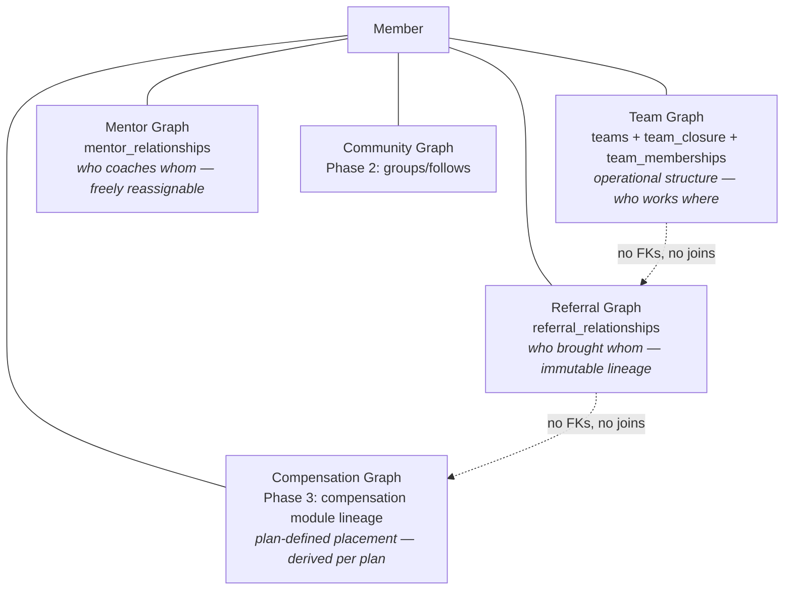

# 05 — Team Architecture

> **Project:** AVIORA · **Date:** 2026-08-19 · **Status:** Accepted
> Covers spec §11–21 (Team & Organization OS) and §17–18 (graph separation).
> Depends on: [03-multi-tenant-architecture.md](./03-multi-tenant-architecture.md)
> Core rules: unlimited nesting, no hard-coded depth, members belong to many teams, history is never destroyed, and **Team Graph ≠ Referral Graph ≠ Compensation Graph**.

---

## 1. Entities

### 1.1 Team

```prisma
model Team {
  id              String     @id @default(dbgenerated("uuid_generate_v7()")) @db.Uuid
  tenantId        String     @map("tenant_id") @db.Uuid
  parentTeamId    String?    @map("parent_team_id") @db.Uuid   // NULL = root team
  teamType        String     @default("GENERAL") @map("team_type") // tenant-defined vocabulary
  code            String                                        // unique within tenant
  name            String
  slug            String
  description     String?
  status          TeamStatus @default(ACTIVE)                   // ACTIVE | ARCHIVED
  primaryLeaderId String?    @map("primary_leader_id") @db.Uuid // denormalized from TeamLeadership
  visibility      TeamVisibility @default(PRIVATE)              // PRIVATE | TENANT | PUBLIC
  settings        Json       @default("{}")
  metadata        Json       @default("{}")
  createdAt       DateTime   @default(now()) @map("created_at") @db.Timestamptz(6)
  updatedAt       DateTime   @updatedAt @map("updated_at") @db.Timestamptz(6)

  parent   Team?  @relation("TeamTree", fields: [parentTeamId], references: [id])
  children Team[] @relation("TeamTree")

  @@unique([tenantId, code])
  @@unique([tenantId, slug])
  @@index([tenantId, parentTeamId])
  @@index([tenantId, status])
  @@map("teams")
}
```

Notes:

- `parent_team_id` (adjacency) is the **source of truth** for structure; the closure table (§2) is a derived, transactionally-maintained index. If they ever disagree, adjacency wins and closure is rebuilt.
- `primary_leader_id` is a denormalized convenience column maintained by the team module from `TeamLeadership` (`is_primary = true`, currently effective). Reads may trust it; writes go through leadership operations only.
- Multiple root teams per tenant are allowed (spec shows Team A/B/C as siblings at tenant level).

### 1.2 TeamMembership

Member ↔ team is many-to-many with history (spec §13: never store `team_id` on Member).

```prisma
model TeamMembership {
  id             String   @id @default(dbgenerated("uuid_generate_v7()")) @db.Uuid
  tenantId       String   @map("tenant_id") @db.Uuid
  teamId         String   @map("team_id") @db.Uuid
  memberId       String   @map("member_id") @db.Uuid
  roleId         String?  @map("role_id") @db.Uuid        // optional team-level role
  membershipType String   @default("MEMBER") @map("membership_type") // MEMBER | GUEST | ALUMNI ...
  status         String   @default("ACTIVE")              // ACTIVE | LEFT | TRANSFERRED
  joinedAt       DateTime @map("joined_at") @db.Timestamptz(6)
  leftAt         DateTime? @map("left_at") @db.Timestamptz(6)
  metadata       Json     @default("{}")

  @@index([tenantId, teamId, status])
  @@index([tenantId, memberId, status])
  @@map("team_memberships")
}
```

- **At most one ACTIVE row per (tenant, team, member)** — enforced by partial unique index (raw migration):
  `CREATE UNIQUE INDEX uq_active_team_membership ON team_memberships (tenant_id, team_id, member_id) WHERE status = 'ACTIVE';`
- Leaving/transferring **closes** the row (`status`, `left_at`) and creates a new one — rows are append-only history, never deleted.

### 1.3 TeamLeadership

Leadership is time-bounded and separate from ordinary membership (spec §14).

```prisma
model TeamLeadership {
  id             String    @id @default(dbgenerated("uuid_generate_v7()")) @db.Uuid
  tenantId       String    @map("tenant_id") @db.Uuid
  teamId         String    @map("team_id") @db.Uuid
  memberId       String    @map("member_id") @db.Uuid
  leadershipRole String    @map("leadership_role")   // PRIMARY_LEADER | CO_LEADER | MANAGER | COACH | MENTOR | tenant-defined
  isPrimary      Boolean   @default(false) @map("is_primary")
  effectiveFrom  DateTime  @map("effective_from") @db.Timestamptz(6)
  effectiveTo    DateTime? @map("effective_to") @db.Timestamptz(6)  // NULL = current
  status         String    @default("ACTIVE")

  @@index([tenantId, teamId, effectiveTo])
  @@index([tenantId, memberId, effectiveTo])
  @@map("team_leaderships")
}
```

- At most one row with `is_primary = true AND effective_to IS NULL` per team (partial unique index).
- Changing a leader = set `effective_to = now()` on the old row + insert a new row. "Who led Team A in March?" is a range query, not archaeology.

### 1.4 TeamClosure

```prisma
model TeamClosure {
  tenantId         String @map("tenant_id") @db.Uuid
  ancestorTeamId   String @map("ancestor_team_id") @db.Uuid
  descendantTeamId String @map("descendant_team_id") @db.Uuid
  depth            Int    // 0 = self

  @@id([tenantId, ancestorTeamId, descendantTeamId])
  @@index([tenantId, descendantTeamId, depth])   // ancestor lookups
  @@index([tenantId, ancestorTeamId, depth])     // descendant lookups
  @@map("team_closure")
}
```

Row count = Σ over teams of (depth of team + 1). A 100,000-team tenant averaging depth 8 ≈ 900k closure rows — trivial for Postgres with these indexes.

---

## 2. Closure table — worked example and SQL

### 2.1 Worked example

Structure:

```
A
├── B
│   └── D
└── C
```

Closure rows (self-rows included, depth 0):

| ancestor | descendant | depth |
| -------- | ---------- | ----- |
| A        | A          | 0     |
| A        | B          | 1     |
| A        | C          | 1     |
| A        | D          | 2     |
| B        | B          | 0     |
| B        | D          | 1     |
| C        | C          | 0     |
| D        | D          | 0     |

### 2.2 Insert a new team (D under B)

Executed in the same transaction as the `teams` insert. `:tenant`, `:new_team`, `:parent` are parameters.

```sql
-- self row
INSERT INTO team_closure (tenant_id, ancestor_team_id, descendant_team_id, depth)
VALUES (:tenant, :new_team, :new_team, 0);

-- one row per ancestor of the parent (including the parent's self row)
INSERT INTO team_closure (tenant_id, ancestor_team_id, descendant_team_id, depth)
SELECT tc.tenant_id, tc.ancestor_team_id, :new_team, tc.depth + 1
FROM team_closure tc
WHERE tc.tenant_id = :tenant
  AND tc.descendant_team_id = :parent;
```

Root team insert = just the self row (the second statement inserts nothing when `parent` is NULL — skipped).

### 2.3 Queries

```sql
-- Descendants of :team (excluding self); add "AND depth <= :n" for bounded depth
SELECT t.*
FROM team_closure tc
JOIN teams t ON t.id = tc.descendant_team_id AND t.tenant_id = tc.tenant_id
WHERE tc.tenant_id = :tenant AND tc.ancestor_team_id = :team AND tc.depth > 0;

-- Direct children only
--   option 1: adjacency
SELECT * FROM teams WHERE tenant_id = :tenant AND parent_team_id = :team;
--   option 2: closure with depth = 1 (identical result)

-- Ancestors of :team, root first (breadcrumb / path)
SELECT t.*, tc.depth
FROM team_closure tc
JOIN teams t ON t.id = tc.ancestor_team_id AND t.tenant_id = tc.tenant_id
WHERE tc.tenant_id = :tenant AND tc.descendant_team_id = :team AND tc.depth > 0
ORDER BY tc.depth DESC;

-- Depth of :team (distance from its root)
SELECT max(depth) FROM team_closure
WHERE tenant_id = :tenant AND descendant_team_id = :team;

-- Siblings
SELECT s.* FROM teams s
JOIN teams me ON me.tenant_id = s.tenant_id
WHERE s.tenant_id = :tenant AND me.id = :team
  AND s.parent_team_id IS NOT DISTINCT FROM me.parent_team_id
  AND s.id <> me.id;

-- Is :maybe_ancestor an ancestor of :team? (used by DESCENDANT_TEAMS permission scope)
SELECT EXISTS (
  SELECT 1 FROM team_closure
  WHERE tenant_id = :tenant
    AND ancestor_team_id = :maybe_ancestor
    AND descendant_team_id = :team
    AND depth > 0
);
```

### 2.4 Move a subtree (`:team` and everything under it → `:new_parent`)

Single transaction; lock the subtree rows first to serialize concurrent moves.

```sql
BEGIN;

-- 0. Guards: same tenant; :new_parent is NOT inside the moving subtree (cycle prevention)
SELECT 1 FROM team_closure
WHERE tenant_id = :tenant AND ancestor_team_id = :team
  AND descendant_team_id = :new_parent
LIMIT 1;
-- if a row exists → ABORT with TEAM_MOVE_CYCLE

-- 1. Update adjacency (source of truth)
UPDATE teams SET parent_team_id = :new_parent, updated_at = now()
WHERE tenant_id = :tenant AND id = :team;

-- 2. Delete closure links between (ancestors OUTSIDE the subtree) and (nodes INSIDE the subtree)
DELETE FROM team_closure tc
USING team_closure sub
WHERE tc.tenant_id = :tenant AND sub.tenant_id = :tenant
  AND sub.ancestor_team_id = :team                      -- sub.descendant = nodes in subtree
  AND tc.descendant_team_id = sub.descendant_team_id
  AND tc.ancestor_team_id NOT IN (                       -- keep links internal to the subtree
    SELECT descendant_team_id FROM team_closure
    WHERE tenant_id = :tenant AND ancestor_team_id = :team
  );

-- 3. Insert new links: (every ancestor of :new_parent incl. itself) × (every node in subtree)
INSERT INTO team_closure (tenant_id, ancestor_team_id, descendant_team_id, depth)
SELECT :tenant, supertree.ancestor_team_id, subtree.descendant_team_id,
       supertree.depth + subtree.depth + 1
FROM team_closure AS supertree
CROSS JOIN team_closure AS subtree
WHERE supertree.tenant_id = :tenant AND subtree.tenant_id = :tenant
  AND supertree.descendant_team_id = :new_parent
  AND subtree.ancestor_team_id = :team;

COMMIT;
```

Moving to root: skip step 3 (or `:new_parent IS NULL` → nothing to cross-join). Cost is O(|subtree| × |new ancestors|) row operations — fine for an admin action; wrap with an advisory lock per tenant tree (`pg_advisory_xact_lock(hashtext(:tenant))`) to serialize concurrent structural edits.

### 2.5 Consistency & rebuild

Because adjacency is authoritative, closure can always be rebuilt (also used by tests to verify move logic):

```sql
-- Rebuild for one tenant (maintenance/verification)
DELETE FROM team_closure WHERE tenant_id = :tenant;
WITH RECURSIVE tree AS (
  SELECT id AS descendant, id AS ancestor, 0 AS depth
  FROM teams WHERE tenant_id = :tenant
  UNION ALL
  SELECT tree.descendant, t.parent_team_id, tree.depth + 1
  FROM tree JOIN teams t ON t.id = tree.ancestor AND t.tenant_id = :tenant
  WHERE t.parent_team_id IS NOT NULL
)
INSERT INTO team_closure (tenant_id, ancestor_team_id, descendant_team_id, depth)
SELECT :tenant, ancestor, descendant, depth FROM tree;
```

A nightly (per-tenant, sampled) checksum compares recursive-CTE output to the closure table and alerts on drift.

---

## 3. Team lifecycle operations — semantics

All operations are tenant-admin/scoped-leader actions, audited, and **history-preserving** (spec §16: "Never permanently destroy organization history").

| Operation                    | State change                                                                                                                                                                                               | History preserved by                                                                  | Events emitted                                     |
| ---------------------------- | ---------------------------------------------------------------------------------------------------------------------------------------------------------------------------------------------------------- | ------------------------------------------------------------------------------------- | -------------------------------------------------- |
| Create team                  | Insert `teams` + closure rows (§2.2)                                                                                                                                                                       | —                                                                                     | `TeamCreated`                                      |
| Create child team            | Same, with `parent_team_id`                                                                                                                                                                                | —                                                                                     | `TeamCreated`                                      |
| Assign / change leader       | Close old `TeamLeadership` (`effective_to`), insert new; update denormalized `primary_leader_id`                                                                                                           | Effective-dated leadership rows                                                       | `LeaderAssigned`                                   |
| Add member                   | Insert ACTIVE `TeamMembership`                                                                                                                                                                             | —                                                                                     | `MemberJoinedTeam`                                 |
| Remove member                | Set `status=LEFT`, `left_at=now()`                                                                                                                                                                         | Closed row remains                                                                    | `MemberLeftTeam`                                   |
| Transfer member (team X → Y) | Close X row (`status=TRANSFERRED`), insert Y row — one transaction                                                                                                                                         | Both rows remain                                                                      | `MemberLeftTeam` + `MemberJoinedTeam` (correlated) |
| Move team                    | §2.4 + audit event capturing old/new parent                                                                                                                                                                | Audit event with before/after; closure history reconstructable from audit             | `TeamMoved { oldParentId, newParentId }`           |
| Merge team (X into Y)        | Transfer all ACTIVE memberships X→Y (as above, `status=MERGED_OUT` on X rows); reparent X's children to Y (§2.4 per child); close X leaderships; set X `status=ARCHIVED` with `metadata.merged_into = Y`   | X row + all closed rows remain; nothing deleted                                       | `TeamMerged { sourceTeamId, targetTeamId }`        |
| Archive team                 | Requires no ACTIVE child teams (archive or move them first). Close ACTIVE memberships (`status=LEFT`) and leaderships; set `status=ARCHIVED`. Closure rows are **kept** (historical queries still resolve) | Everything retained; archived teams excluded from default queries via `status` filter | `TeamArchived`                                     |

Rules:

- Deletes are not exposed. There is no `DELETE /teams/:id`; only archive.
- Metric snapshots (§4) are keyed by `(tenant_id, team_id, period)` and are never rewritten on move/merge — historical dashboards show what the org looked like _then_. Post-move periods reflect the new structure.
- Every structural operation writes an `audit_logs` row with `before`/`after` JSON (spec §60 lists Team and Leader changes as mandatory audit subjects).

---

## 4. Metrics: direct vs organization rollup

Spec §20 requires strict separation of `direct_*` from `organization_*` metrics.

**Definitions**

- **Direct metrics** of team T: computed over rows attached to T itself (ACTIVE `team_memberships.team_id = T`, sales attributed to T, etc.).
- **Organization metrics** of team T: computed over T ∪ descendants(T) (closure `ancestor = T`), with **member-level de-duplication** — a member in two descendant teams counts once in `organization_members`.

**Strategy: precomputed snapshots, event-refreshed — never synchronous per-request rollups.**

```prisma
model TeamMetricSnapshot {
  id           String   @id @default(dbgenerated("uuid_generate_v7()")) @db.Uuid
  tenantId     String   @map("tenant_id") @db.Uuid
  teamId       String   @map("team_id") @db.Uuid
  period       String   // 'current' | '2026-08' | '2026-W34' ...
  scope        String   // 'DIRECT' | 'ORGANIZATION'
  metrics      Json     // { members, active_members, new_members, leads, customers, sales, ... }
  computedAt   DateTime @map("computed_at") @db.Timestamptz(6)

  @@unique([tenantId, teamId, period, scope])
  @@index([tenantId, teamId, period])
  @@map("team_metric_snapshots")
}
```

Refresh pipeline (analytics module, doc 11 handlers):

1. Contributing events (`MemberJoinedTeam`, `MemberLeftTeam`, `GoalCompleted`, `CourseCompleted`, `CustomerConverted`, `OrderCompleted`…) mark the **directly affected team dirty** in Redis (`tenant:{id}:analytics:dirty-teams` set).
2. A debounced BullMQ job (e.g., every 60s per tenant with dirty teams) recomputes DIRECT snapshots for dirty teams, then ORGANIZATION snapshots for the dirty teams **and all their ancestors** (one closure query gives the ancestor set).
3. Organization aggregation runs as a single set-based SQL query over the closure join — not by summing child snapshots (child-summing breaks member de-duplication and double-counts multi-team members).

```sql
-- organization_members for team :team (de-duplicated)
SELECT count(DISTINCT tm.member_id)
FROM team_closure tc
JOIN team_memberships tm
  ON tm.tenant_id = tc.tenant_id AND tm.team_id = tc.descendant_team_id AND tm.status = 'ACTIVE'
WHERE tc.tenant_id = :tenant AND tc.ancestor_team_id = :team;
```

Dashboards (spec §20–21) read snapshots only; a `computed_at` staleness of ≤ a few minutes is acceptable and displayed. Leader drill-down navigates the tree via closure queries and reads each node's snapshot.

---

## 5. Permission scopes over the hierarchy

The RBAC scopes (doc 00 §7) bind to the closure table:

| Scope              | Resolution                                                                                              |
| ------------------ | ------------------------------------------------------------------------------------------------------- |
| `SELF`             | `member_id = ctx.memberId`                                                                              |
| `DIRECT_TEAM`      | Teams where the caller holds a current leadership row (or ACTIVE membership, per permission definition) |
| `DESCENDANT_TEAMS` | `DIRECT_TEAM` set expanded through closure (`ancestor IN led_teams`)                                    |
| `SPECIFIC_TEAMS`   | Explicit grant list on the role/assignment                                                              |
| `TENANT_ALL`       | All teams in tenant                                                                                     |

The `team` module exports one application service used by every other module's guards:

```ts
// team module public API
getAuthorizedTeamIds(ctx: TenantContext, permission: string): Promise<Set<string>>;
isTeamInScope(ctx: TenantContext, permission: string, teamId: string): Promise<boolean>;
```

Results cached per request (CLS) and in Redis (`tenant:{id}:team:scope:{member_id}:{permission}`, invalidated on `TeamMoved`/`LeaderAssigned`/membership events). Spec §73's second vertical slice is the acceptance test: parent leaders see authorized descendants; child leaders cannot see ancestors/siblings.

---

## 6. Graph separation (spec §17–18) — mandatory

A member participates in several **independent** relationship graphs. They may correlate socially; they must never couple structurally.



Hard rules (spec §78.8–9, enforced by module boundaries + review checklist):

1. No foreign key, join, or service call may derive team placement from referral lineage or vice versa. Member A recruits Member B; B may operate under an unrelated team leader — both facts stored, neither implies the other.
2. The future compensation module (Phase 3) builds its own placement graph from `CompensationPlan` rules. It may _read_ the referral graph as an input via the referral module's exported service — it never reads `team_closure` for payout lineage, and the team module never reads compensation placement.
3. Referral relationships are effective-dated and append-only — lineage corrections close a row and add a new one; they never rewrite history.

### 6.1 ReferralRelationship (table created in MVP; logic in Phase 3)

```prisma
model ReferralRelationship {
  id               String    @id @default(dbgenerated("uuid_generate_v7()")) @db.Uuid
  tenantId         String    @map("tenant_id") @db.Uuid
  referrerMemberId String    @map("referrer_member_id") @db.Uuid
  referredMemberId String    @map("referred_member_id") @db.Uuid
  relationshipType String    @map("relationship_type")  // REFERRAL | SPONSOR | INTRODUCER | AFFILIATE | MENTOR_REFERRAL
  effectiveFrom    DateTime  @map("effective_from") @db.Timestamptz(6)
  effectiveTo      DateTime? @map("effective_to") @db.Timestamptz(6)
  metadata         Json      @default("{}")

  @@index([tenantId, referrerMemberId, effectiveTo])
  @@index([tenantId, referredMemberId, effectiveTo])
  @@map("referral_relationships")
}
```

- At most one current (`effective_to IS NULL`) row per `(tenant, referred_member, relationship_type)` — partial unique index.
- Captured at registration (invite/referral code) because this data is unrecoverable if not written at the moment it happens. MVP builds **no features** on it beyond capture; the referral graph is intentionally shallow until Phase 3 (doc 00 §6).
- The referral graph is a forest per relationship type; depth queries, when needed in Phase 3, will use recursive CTEs (referral trees are read far less often than team trees — no closure table needed until measured otherwise).

### 6.2 MentorRelationship

Same shape as `ReferralRelationship` (`mentor_member_id`, `mentee_member_id`, effective dates). Mentors are reassignable at will; unlike referral lineage there is no immutability expectation — but rows are still closed, not deleted.

---

## 7. Test checklist (from spec §69, §73)

- Hierarchy: create → child → grandchild; closure rows match §2.1 pattern at each step.
- Move: move `A1.1` under `B`; closure rebuilt correctly (compare to recursive-CTE rebuild); cycle move (`A` under `A1.1`) rejected.
- Merge: memberships transferred once, history rows retained, children reparented, source archived.
- Rollup: `organization_members` de-duplicates a member in two descendant teams; direct ≠ organization.
- Permissions: parent leader reads descendant dashboards; child leader gets 404/403 on ancestor/sibling; `SPECIFIC_TEAMS` grant honored.
- History: leader change mid-month → "who led on date X" answers correctly from effective-dated rows.
- Isolation: all of the above double-checked cross-tenant (Tenant A ids invisible to Tenant B).
