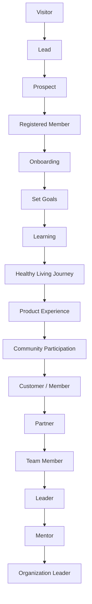

# 06 — Member Lifecycle

> The member journey is a first-class, **tenant-configurable** state machine — never hard-coded stages (spec §3, §23, §25).
>
> Status: Approved · Last updated: 2026-08-19 · Source: spec §3, §23, §25, §34, §65

---

## 1. Three Configurable Journeys, One Person

AVIORA models three related but distinct journeys. They share a member but have independent configuration, state, and events:

| Journey              | Question it answers                                                                     | Config entity                           | Typical owner domain                |
| -------------------- | --------------------------------------------------------------------------------------- | --------------------------------------- | ----------------------------------- |
| **Lifecycle** (§3)   | "What is this person's relationship to the tenant?" (visitor → … → organization leader) | `LifecycleStage`                        | identity / crm                      |
| **Growth** (§23)     | "How developed is this member as a builder/leader?" (starter → … → executive leader)    | `GrowthStage`                           | business (rules) + identity (state) |
| **Onboarding** (§25) | "Which activation steps has this new member completed?"                                 | `OnboardingTemplate` + `OnboardingStep` | identity / learning                 |

They are deliberately separate: a person can be a long-time _Customer_ (lifecycle) who never enters the growth journey; a _Partner_ can restart an onboarding journey when the tenant launches a new program.

## 2. Reference Lifecycle (Default Template)

The generic journey the platform ships as a **default template** — tenants may rename, remove, reorder, or add stages:



Notes on the reference model:

- **Visitor → Prospect** live in the **crm** domain (they are not yet Members; they are `Lead`/`Prospect` records owned by a referring member or the tenant).
- **Registered Member onward** lives in the **identity** domain as `Member.lifecycle_stage_id`.
- The middle stages (Onboarding, Set Goals, Learning, Healthy Living, Product Experience, Community) are _experience phases_, not exclusive states — a tenant may model them as lifecycle stages, as onboarding steps, or both. The default template models them as onboarding steps and keeps the lifecycle coarse (`registered → active_member → customer_member → partner → leader → mentor → organization_leader`).

## 3. Tenant Configurability — `LifecycleStage` Concept

Lifecycle stages are **rows, not enums**. Conceptual model (final shapes in `08-data-model.md`):

```text
lifecycle_stage
├── id                    uuid v7 PK
├── tenant_id             NOT NULL (RLS via app.tenant_id)
├── code                  e.g. 'partner' — stable key, unique per tenant
├── name_i18n             jsonb {th, en}
├── description_i18n      jsonb
├── stage_order           int — display/progression order
├── stage_kind            PRE_MEMBER | MEMBER | LEADERSHIP (coarse classification the platform understands)
├── entry_rules           jsonb — declarative conditions (see §5)
├── auto_advance          boolean — advance automatically when entry_rules of next stage satisfied
├── is_initial            boolean — stage assigned at registration
├── is_active             boolean
├── metadata              jsonb
├── created_at / updated_at   timestamptz
```

Member state:

```text
member_lifecycle_state
├── id, tenant_id, member_id
├── lifecycle_stage_id
├── entered_at            timestamptz
├── source                MANUAL | RULE | AUTOMATION | IMPORT
├── changed_by_user_id    nullable
└── metadata
```

Plus an append-only `member_lifecycle_history` (stage, entered_at, exited_at, reason) — history is never destroyed (spec §16 principle applied platform-wide).

**Platform-understood invariants** (the only things code may rely on):

1. Every tenant has exactly one `is_initial` MEMBER-kind stage.
2. Stage `code` is tenant-scoped and stable; UI text comes from `name_i18n` (th/en from day 1).
3. Code never branches on stage codes like `'partner'` — features gate on **entitlements and permissions**, not lifecycle names.

## 4. Growth Journey — `GrowthStage`

Configurable growth pathway (spec §23). Default template (tenant renames freely; never hard-code team names or company terminology):

```text
Starter → Active Member → Builder → Leader → Senior Leader → Mentor → Executive Leader
```

```text
growth_stage
├── id, tenant_id, code, name_i18n, stage_order
├── requirements          jsonb — array of requirement objects
└── is_active, metadata, timestamps
```

Each stage can require any combination of (spec §23): **learning** (courses/certifications completed), **activity** (tasks, logins, streaks), **customers** (CRM conversions), **team** (direct/organization members), **goal** (goals set/completed), **sales** (volume — Phase 2+), **qualification**, **certification**. Requirement objects are declarative, e.g.:

```json
{ "type": "course_completed", "course_code": "foundation-101" }
{ "type": "customers_converted", "min": 3, "window_days": 90 }
{ "type": "direct_team_members", "min": 5 }
```

MVP evaluates requirement types that MVP domains can supply (learning, goals, activity, customers, team). Sales/rank requirement types register in the schema but activate in Phase 2/3. Growth-stage progression is evaluated by a BullMQ worker reacting to relevant domain events, and can also be manually granted by an authorized admin (audited).

## 5. Onboarding Journey — Templates

Tenant Admin creates **onboarding templates** (spec §25); the default mirrors:

```text
Register → Profile → Dreams → Goals → Learning → Product Experience → Community → Customer Skills → Team Skills → Leadership
```

```text
onboarding_template
├── id, tenant_id, code, name_i18n
├── applies_to            jsonb — e.g. {membership_plan_codes:[...], team_ids:[...], default:true}
└── is_active, timestamps

onboarding_step
├── id, tenant_id, template_id, step_order, code, name_i18n
├── step_type             PROFILE | GOAL | DREAM | COURSE | TASK | COMMUNITY | CUSTOM
├── completion_rule       jsonb — e.g. {"type":"course_completed","course_code":"welcome"}
├── is_required           boolean
└── metadata

member_onboarding_progress
├── id, tenant_id, member_id, template_id, step_id
├── status                PENDING | IN_PROGRESS | COMPLETED | SKIPPED
├── completed_at          timestamptz
```

On `MemberRegistered`, the matching template (plan → team → tenant default precedence) is instantiated for the member. Step completion is event-driven where possible (e.g. a `GoalCreated` event auto-completes a GOAL step) and manual otherwise.

## 6. Transitions

A lifecycle transition occurs when:

1. **Rule-based**: the member satisfies `entry_rules` of a later stage and either `auto_advance` is true or an authorized user confirms. Rules use the same declarative requirement vocabulary as growth stages.
2. **Manual**: a user holding `member.lifecycle.manage` (scoped — e.g. a leader with `DIRECT_TEAM` scope can only advance their own team's members) sets the stage. Always audited with before/after.
3. **Automation** (Phase 3): an automation action moves the stage.

Transition guarantees:

- Transitions are recorded in `member_lifecycle_history`; the previous state is never overwritten.
- Backward transitions are allowed (e.g. churn/win-back flows) and equally audited.
- Transition handlers run in the same transaction as the state change; events go to the outbox atomically.
- Stage deletion is soft (`is_active = false`); members in a deactivated stage keep their state until moved.

## 7. Events Emitted

All events are PascalCase, written to the outbox, delivered via BullMQ (canonical event architecture):

| Event                               | Emitted when                                                     | Typical consumers                                                  |
| ----------------------------------- | ---------------------------------------------------------------- | ------------------------------------------------------------------ |
| `MemberRegistered`                  | User completes tenant registration; Member row created           | onboarding instantiation, notification (welcome), analytics, audit |
| `MembershipActivated`               | Membership becomes active                                        | entitlement cache, notification, analytics                         |
| `MemberOnboardingStarted`           | Onboarding template instantiated                                 | notification, analytics                                            |
| `MemberOnboardingStepCompleted`     | A step's completion rule satisfied                               | next-step nudge notification, analytics                            |
| `MemberOnboardingCompleted`         | All required steps completed                                     | lifecycle rule evaluation, reward (P2+), analytics                 |
| `MemberLifecycleStageChanged`       | Any lifecycle transition (payload: from_stage, to_stage, source) | notification, automation (P3), analytics, audit                    |
| `MemberGrowthStageAchieved`         | Growth requirements satisfied and stage granted                  | notification, recognition (P2), analytics, audit                   |
| `GoalCreated` / `GoalCompleted`     | Goal domain                                                      | onboarding step completion, growth evaluation, dashboard           |
| `CourseStarted` / `CourseCompleted` | Learning domain                                                  | onboarding/growth evaluation, dashboard, notification              |
| `MemberJoinedTeam`                  | TeamMembership created                                           | team dashboard, growth evaluation                                  |
| `CustomerConverted`                 | CRM pipeline reaches customer stage                              | lifecycle rule evaluation, growth evaluation, analytics            |
| `MemberInactive` (P2)               | Inactivity detector threshold crossed                            | win-back automation, leader alert                                  |

Consumers must be idempotent (events may be delivered more than once) and must re-check permissions/tenant context — an event payload never grants authority.

## 8. Scope Notes (MVP vs Later)

| Capability                                                         | MVP                                       | Later                                  |
| ------------------------------------------------------------------ | ----------------------------------------- | -------------------------------------- |
| LifecycleStage config CRUD + default template seeding per tenant   | ✅                                        | —                                      |
| Manual + rule-based transitions, history, audit                    | ✅                                        | automation-driven (P3)                 |
| GrowthStage config + evaluation for MVP-supplied requirement types | ✅                                        | sales/rank requirements (P2/P3)        |
| Onboarding templates + steps + progress                            | ✅ (PROFILE/GOAL/DREAM/COURSE/TASK types) | COMMUNITY/CUSTOM types (P2)            |
| Lifecycle-driven notifications                                     | ✅ basic (in-app/email)                   | LINE/push (P2), full preference center |
| Win-back / inactivity journeys                                     | —                                         | P2/P3                                  |

## 9. Related Documents

- [02-domain-map.md](./02-domain-map.md) — owning domains (identity, crm, business, learning)
- [14-mvp-scope.md](./14-mvp-scope.md) — MVP boundary for lifecycle features
- [15-mvp-user-journey.md](./15-mvp-user-journey.md) — Slice 1 exercises registration → onboarding → goal → course
