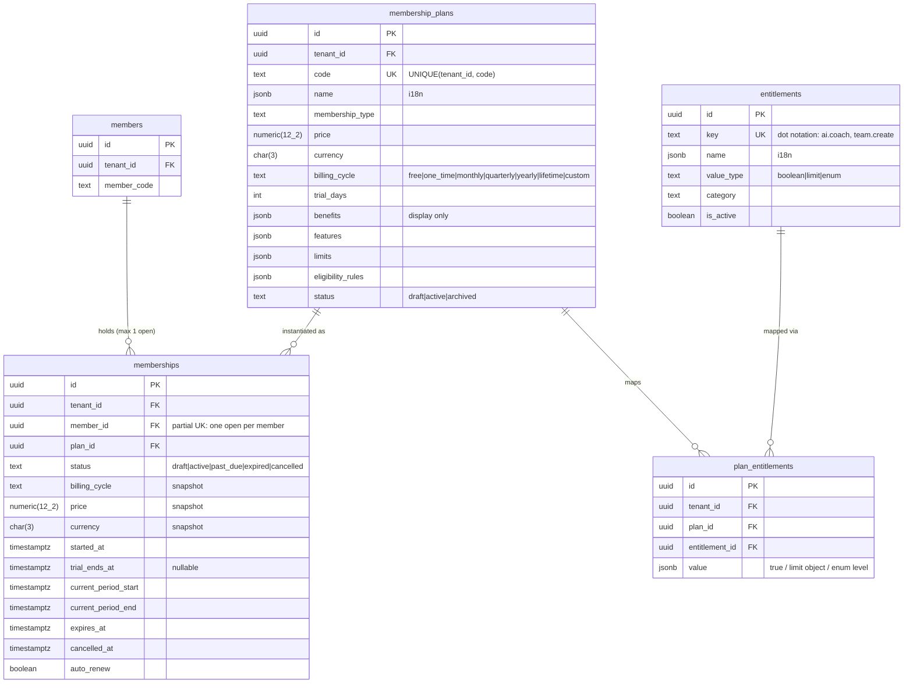
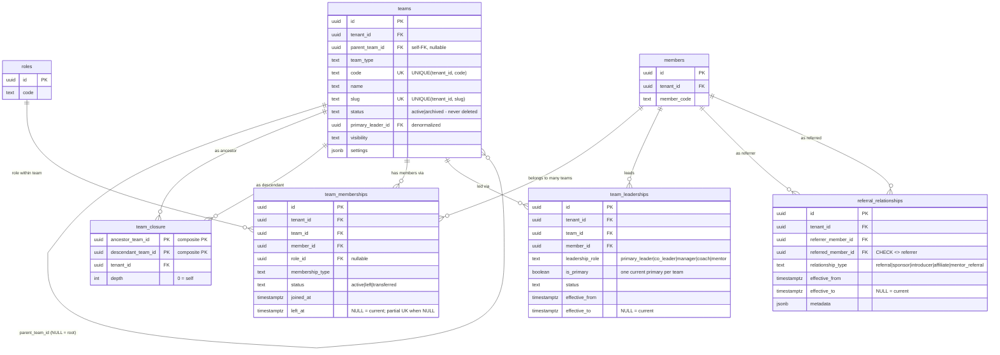
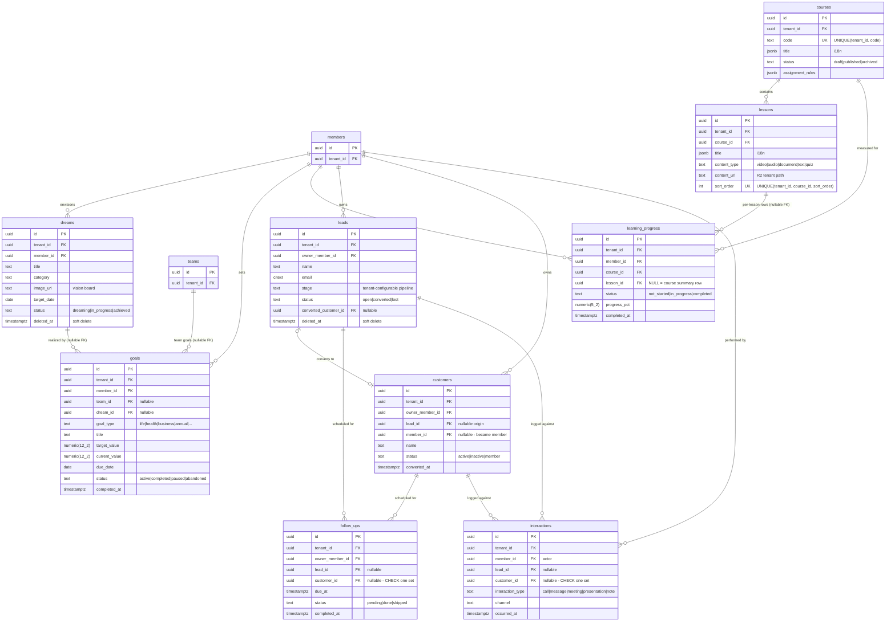
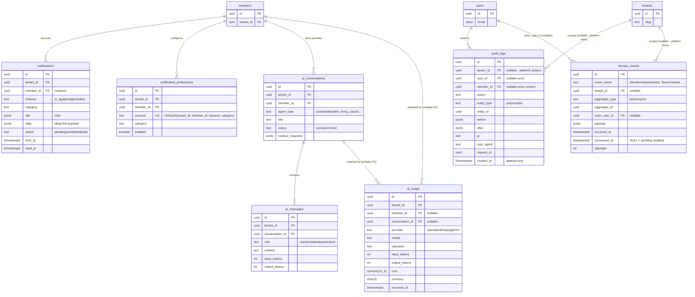

# 09 — ER Diagrams

> AVIORA — Multi-Tenant Membership, Healthy Living & Growth Operating System
> Status: Approved for MVP · Last updated: 2026-08-19
> Companion to [08-data-model.md](./08-data-model.md) (authoritative column definitions) and [04-membership-model.md](./04-membership-model.md).

One giant diagram is unreadable, so the MVP schema is split into five focused views. Conventions in all diagrams:

- Table names are physical (snake_case). PK = primary key, FK = foreign key, UK = unique constraint (tenant-scoped unless noted).
- Every tenant-owned table has `tenant_id` FK → `tenants` — drawn explicitly only in Diagram A to avoid clutter; assume it everywhere else.
- `id` is always `uuid` (v7); `created_at`/`updated_at timestamptz` exist on every table (omitted from diagrams except where structurally interesting).
- `||--o{` = one-to-many, `||--||` = one-to-one, `}o--o{` via join tables only.

---

## A. Identity & Tenancy

User is global; Member is per-tenant; TenantMembership links them (spec §7). Roles/permissions are RBAC with scope (spec §19, §57).

```mermaid
erDiagram
    tenants ||--o{ tenant_settings : "has"
    tenants ||--o{ tenant_features : "has"
    tenants ||--o{ tenant_memberships : "has"
    tenants ||--o{ members : "has"
    tenants ||--o{ lifecycle_stages : "configures"
    tenants ||--o{ invitations : "issues"
    tenants ||--o{ roles : "defines custom (tenant_id nullable)"

    users ||--o{ tenant_memberships : "joins tenants via"
    users ||--o{ members : "is person behind"
    users ||--o{ invitations : "invited_by"

    members ||--|| member_profiles : "has profile"
    members }o--|| lifecycle_stages : "at stage"
    members ||--o{ member_roles : "granted"

    roles ||--o{ member_roles : "assigned as"
    roles ||--o{ role_permissions : "grants"
    permissions ||--o{ role_permissions : "granted via"

    tenants {
        uuid id PK
        text code UK "globally unique"
        text slug UK "subdomain"
        text name
        text tenant_type
        text status
        char(2) country
        text timezone
        char(2) default_language
        char(3) default_currency
        jsonb branding
        jsonb settings
        jsonb feature_flags
    }
    users {
        uuid id PK
        citext email UK "globally unique"
        text name
        text password_hash "nullable (SSO)"
        text status
        text platform_role "nullable"
        boolean mfa_enabled
    }
    tenant_memberships {
        uuid id PK
        uuid tenant_id FK
        uuid user_id FK
        text status "invited|active|suspended|left"
        boolean is_owner
        text_arr roles
        timestamptz joined_at
        timestamptz left_at "nullable - history kept"
    }
    members {
        uuid id PK
        uuid tenant_id FK
        uuid user_id FK
        text member_code UK "UNIQUE(tenant_id, member_code)"
        text display_name
        text status
        uuid lifecycle_stage_id FK "nullable"
        jsonb custom_fields
        timestamptz deleted_at "soft delete"
    }
    member_profiles {
        uuid id PK
        uuid tenant_id FK
        uuid member_id FK "UNIQUE - 1:1"
        date birth_date
        jsonb address
        jsonb social_links
        jsonb preferences
    }
    lifecycle_stages {
        uuid id PK
        uuid tenant_id FK
        text code UK "UNIQUE(tenant_id, code)"
        jsonb name "i18n"
        int sort_order
        jsonb requirements
    }
    roles {
        uuid id PK
        uuid tenant_id FK "NULL = platform system role"
        text code UK "UNIQUE(tenant_id, code)"
        jsonb name "i18n"
        boolean is_system
    }
    permissions {
        uuid id PK
        text key UK "dot notation, platform catalog"
        text default_scope "SELF..TENANT_ALL"
        text category
    }
    role_permissions {
        uuid id PK
        uuid role_id FK
        uuid permission_id FK
        text scope "SELF|DIRECT_TEAM|DESCENDANT_TEAMS|SPECIFIC_TEAMS|TENANT_ALL"
        jsonb scope_config
    }
    member_roles {
        uuid id PK
        uuid tenant_id FK
        uuid member_id FK
        uuid role_id FK
        timestamptz effective_from
        timestamptz effective_to "NULL = current"
    }
    tenant_settings {
        uuid id PK
        uuid tenant_id FK
        text key UK "UNIQUE(tenant_id, key)"
        jsonb value
    }
    tenant_features {
        uuid id PK
        uuid tenant_id FK
        text feature_key UK "UNIQUE(tenant_id, feature_key)"
        boolean enabled
        jsonb config
    }
    invitations {
        uuid id PK
        uuid tenant_id FK
        citext email
        text token_hash UK
        uuid role_id FK "nullable"
        uuid team_id FK "nullable"
        uuid membership_plan_id FK "nullable"
        text status
        timestamptz expires_at
    }
```

---

## B. Membership & Entitlements

Plan → plan_entitlements → entitlement catalog → capability checks (spec §8–§9, doc 04). `entitlements` is a platform catalog (no `tenant_id`); everything else is tenant-owned.

---

## C. Team & Relationship Graphs

Team tree (`parent_team_id` + closure table) and the referral graph are **separate structures — never coupled** (spec §15, §17–§18). All relationship rows are effective-dated; history is never destroyed (spec §16).

---

## D. Growth, Learning & CRM

Dreams/Goals (spec §22), Learning OS (spec §24), and member-owned CRM (spec §34). CRM records belong to an **owner member** (the member working the lead), scoped by team permissions at query time.

---

## E. Platform Services

Notifications (spec §52), AI OS (spec §46–§48, member-private conversations), audit (spec §60), and the transactional outbox (spec §64–§65). `audit_logs` and `domain_events` reference aggregates polymorphically (`entity_type`/`aggregate_type` + id), so no hard FKs to business tables.

---

## Reading Guide

| If you're working on…                                | Start with diagram | Then read                                           |
| ---------------------------------------------------- | ------------------ | --------------------------------------------------- |
| Auth, tenant switcher, onboarding, RBAC              | A                  | 08 §3.1–3.9, 3.14–3.17                              |
| Plans, activation, entitlement gates                 | B                  | 04 (full), 08 §3.10–3.13                            |
| Team hierarchy, move/merge, leader scopes, referrals | C                  | 08 §4.1–4.5, 05-team-architecture.md                |
| Goals, courses, CRM pipeline                         | D                  | 08 §4.6–4.14                                        |
| Notifications, AI assistant, audit, event outbox     | E                  | 08 §3.18–3.19, §4.15–4.19, 11-event-architecture.md |
