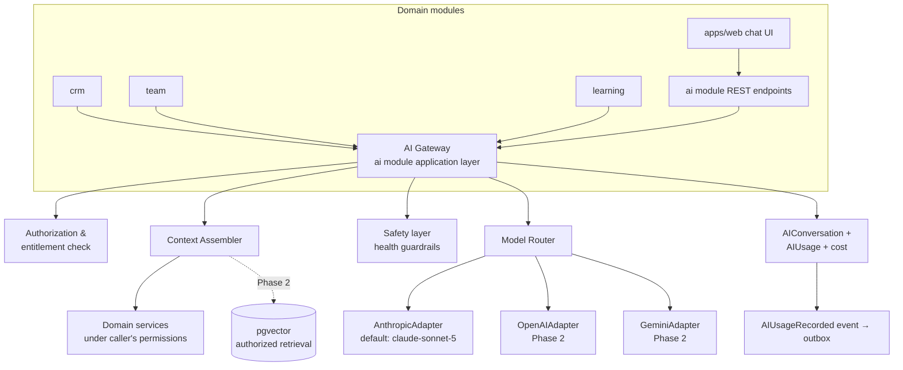

# 12 — AI Architecture

> **Project:** AVIORA · **Date:** 2026-08-19 · **Status:** Accepted
> Covers spec §46–50 (AI OS, AI Context, AI Agents, AI Team Coach, AI Knowledge Security) and §27/§59 health-safety constraints.
> Depends on: [03-multi-tenant-architecture.md](./03-multi-tenant-architecture.md), [11-event-architecture.md](./11-event-architecture.md)
> MVP scope: **one Basic AI Assistant** through the full gateway architecture. The gateway is built properly on day 1; the agents are added as configurations, not systems.

---

## 1. Architecture overview



Layering rule: **no domain module ever imports a provider SDK.** Everything goes through the `ai` module's exported application service (`AIGatewayService`). The provider is a config detail; swapping or adding providers touches only adapter code.

---

## 2. Provider adapter interface

```ts
// modules/ai/domain/provider.types.ts
export interface AIProviderAdapter {
  readonly providerKey: string; // 'anthropic' | 'openai' | 'gemini' | ...

  complete(req: AICompletionRequest): Promise<AICompletionResult>;
  stream(req: AICompletionRequest): AsyncIterable<AICompletionChunk>;
  countTokens?(req: AICompletionRequest): Promise<number>; // optional; estimator fallback
}

export interface AICompletionRequest {
  model: string; // provider-native model id
  system: string; // fully assembled system prompt (incl. safety layer)
  messages: AIMessage[]; // role: 'user' | 'assistant'
  maxTokens: number;
  temperature?: number;
  metadata: {
    tenantId: string; // for provider-side attribution headers where supported
    conversationId: string;
    requestId: string;
  };
}

export interface AICompletionResult {
  text: string;
  stopReason: 'end' | 'max_tokens' | 'refusal' | 'error';
  usage: { inputTokens: number; outputTokens: number };
  model: string; // model actually used (router may substitute)
  latencyMs: number;
}
```

- **Default provider: Anthropic; default model: `claude-sonnet-5`.** Configured per environment; overridable per tenant (feature flag) and per agent (model policy), never per raw request from the client.
- Adapters normalize provider errors into a small taxonomy (`RATE_LIMITED`, `CONTEXT_TOO_LONG`, `PROVIDER_DOWN`, `CONTENT_REFUSED`) so the router can make fallback decisions.
- Adapters are stateless; API keys come from secrets management (never tenant-supplied in MVP; BYO-key is a Phase 4 enterprise option).

---

## 3. Model router

Routing policy = f(agent, task class, tenant plan, health flags):

```ts
interface ModelPolicy {
  agentKey: string; // 'basic-assistant', 'crm-assistant', ...
  taskClass: 'chat' | 'summarize' | 'classify' | 'generate' | 'analyze';
  primary: { provider: string; model: string };
  fallback: { provider: string; model: string }[]; // tried on PROVIDER_DOWN / RATE_LIMITED
  maxTokens: number;
  temperature: number;
}
```

MVP routing table (deliberately boring):

| Agent / task                                    | Primary                     | Fallback                      |
| ----------------------------------------------- | --------------------------- | ----------------------------- |
| basic-assistant · chat                          | anthropic / claude-sonnet-5 | none (surface graceful error) |
| internal · summarize/classify (future CRM jobs) | anthropic / claude-sonnet-5 | none                          |

The router also enforces **quotas before dispatch**: per-tenant daily token/cost budget and per-member rate limits (Redis counters `tenant:{id}:ai:budget:{yyyy-mm-dd}`). Over budget → `429 AI_QUOTA_EXCEEDED` with a clean client message — cost-bomb protection is a router responsibility, not an afterthought.

---

## 4. AI context assembly (spec §47)

Context is assembled **server-side, per request, under the caller's authority**. The client sends only the user's message and conversation id — never context, never permissions.

```
System prompt =
  [1] Platform base prompt (immutable)
  [2] Safety layer (health guardrails — immutable, always last-word)
  [3] Agent persona (per agent key; tenant-customizable copy within guardrails)
  [4] Tenant context      — tenant name, branding voice, locale (th/en), timezone, currency
  [5] User/Member context — display name, roles, lifecycle stage, membership plan
  [6] Entitlement context — which capabilities the member's plan grants (ai.coach etc.)
  [7] Permission & team scope — the member's permission scopes; authorized team ids (from team module)
  [8] Business-rule context — tenant-configured stage names, goal categories (so AI speaks the tenant's vocabulary)
  [9] Task context — data snapshot assembled for this request (see below)
```

**Task context is fetched through the same application services the REST API uses**, with the caller's TenantContext — meaning permission scopes, RLS, and the Prisma tenant extension all apply. The assembler cannot leak what the user could not see on a screen. Examples:

| User intent (classified)        | Assembler fetches                                                                      |
| ------------------------------- | -------------------------------------------------------------------------------------- |
| "How am I doing on my goals?"   | Caller's goals + progress (`SELF` scope)                                               |
| "What should my team focus on?" | Team snapshot(s) for teams within caller's `DIRECT_TEAM`/`DESCENDANT_TEAMS` scope only |
| "Summarize this lead"           | The lead — only if caller owns it or holds `crm.lead.view` in scope                    |
| General question                | Knowledge context (Phase 2 RAG); MVP: none                                             |

Token budgeting: fixed layer budgets ([1]–[3] ~600 tokens; [4]–[8] ~400; [9] capped, truncated by relevance) so context never overflows and cost stays predictable.

---

## 5. Authorization-before-retrieval RAG (Phase 2 design, decided now)

Spec §50: _"Retrieval must enforce authorization before retrieval. Never retrieve unauthorized content and filter afterward."_

**MVP satisfies this by construction** — there is no vector retrieval; all context comes from permission-checked structured queries.

Phase 2 (pgvector) design:

```sql
CREATE TABLE knowledge_embeddings (
  id           uuid PRIMARY KEY,
  tenant_id    uuid,                          -- NULL only for GLOBAL visibility rows
  visibility   text NOT NULL,                 -- GLOBAL | TENANT | TEAM | MEMBER
  team_id      uuid,                          -- required when visibility = TEAM
  member_id    uuid,                          -- required when visibility = MEMBER
  source_type  text NOT NULL,                 -- article | course | product | note ...
  source_id    uuid NOT NULL,
  chunk_index  int  NOT NULL,
  content      text NOT NULL,
  embedding    vector(1024) NOT NULL,
  created_at   timestamptz NOT NULL DEFAULT now()
);
-- RLS on this table like any tenant-owned table (GLOBAL rows via a separate policy)
```

Retrieval query — the authorization predicate is **inside the WHERE clause, evaluated before similarity ordering**:

```sql
SELECT content, source_type, source_id
FROM knowledge_embeddings
WHERE (
        visibility = 'GLOBAL'
     OR (visibility = 'TENANT' AND tenant_id = :tenant)
     OR (visibility = 'TEAM'   AND tenant_id = :tenant AND team_id = ANY(:authorized_team_ids))
     OR (visibility = 'MEMBER' AND tenant_id = :tenant AND member_id = :member)
      )
ORDER BY embedding <=> :query_embedding
LIMIT 8;
```

`:authorized_team_ids` comes from the team module's `getAuthorizedTeamIds()` (doc 05 §5) — the same source of truth the REST API uses. There is no code path that ranks first and filters later. RLS backs this up at the DB layer. Embedding ingestion is an event handler (`ArticlePublished` etc.) that stamps visibility at write time from the source entity's ACL.

---

## 6. Logical agents catalog (spec §48)

Agents are **configurations** (persona + allowed context assemblers + model policy + entitlement key), not separate services. Adding an agent = adding a config row + prompt file.

| Agent key              | Purpose                                                                                                                                                      | Entitlement     | Phase   |
| ---------------------- | ------------------------------------------------------------------------------------------------------------------------------------------------------------ | --------------- | ------- |
| `basic-assistant`      | General member assistant: goals, learning, navigation, tenant FAQ                                                                                            | `ai.assistant`  | **MVP** |
| `healthy-living-coach` | Wellness guidance within safety rules; habit/goal support                                                                                                    | `ai.coach`      | 2       |
| `knowledge-assistant`  | Q&A over knowledge graph (RAG)                                                                                                                               | `ai.knowledge`  | 2       |
| `learning-coach`       | Course guidance, study plans, quiz help                                                                                                                      | `ai.learning`   | 2       |
| `crm-assistant`        | Lead summaries, follow-up drafting, next best action                                                                                                         | `ai.crm`        | 2       |
| `content-assistant`    | Content drafting for creators/admins                                                                                                                         | `ai.content`    | 2       |
| `product-assistant`    | Product Q&A grounded in Product Intelligence (never medical claims)                                                                                          | `ai.product`    | 2       |
| `business-coach`       | Business KPI insight for partners                                                                                                                            | `ai.business`   | 3       |
| `team-coach`           | Team analytics narration: growth, at-risk members, focus areas (spec §49) — **strictly scope-bound**: answers only over teams in the caller's authorized set | `ai.team`       | 3       |
| `leadership-coach`     | Leadership development guidance                                                                                                                              | `ai.leadership` | 3       |
| `admin-assistant`      | Tenant-admin operations help                                                                                                                                 | `ai.admin`      | 3       |
| `analytics-assistant`  | Natural-language over analytics snapshots                                                                                                                    | `ai.analytics`  | 3       |

Gateway checks, in order: (1) member's plan grants the agent's entitlement; (2) tenant feature flag enables the agent; (3) permission scopes bound the context. The AI Team Coach's example questions (§49 — "which team is growing fastest?") are answered from `team_metric_snapshots` (doc 05 §4) restricted to the caller's authorized team set — the AI never sees teams the leader couldn't open in the dashboard.

---

## 7. Conversation, usage, and cost tracking

```prisma
model AIConversation {
  id        String   @id @default(dbgenerated("uuid_generate_v7()")) @db.Uuid
  tenantId  String   @map("tenant_id") @db.Uuid
  memberId  String   @map("member_id") @db.Uuid
  agentKey  String   @map("agent_key")
  title     String?
  status    String   @default("ACTIVE")      // ACTIVE | ARCHIVED
  metadata  Json     @default("{}")
  createdAt DateTime @default(now()) @map("created_at") @db.Timestamptz(6)
  updatedAt DateTime @updatedAt @map("updated_at") @db.Timestamptz(6)

  @@index([tenantId, memberId, updatedAt])
  @@map("ai_conversations")
}

model AIMessage {
  id             String   @id @default(dbgenerated("uuid_generate_v7()")) @db.Uuid
  tenantId       String   @map("tenant_id") @db.Uuid
  conversationId String   @map("conversation_id") @db.Uuid
  role           String                            // user | assistant | system-note
  content        String
  createdAt      DateTime @default(now()) @map("created_at") @db.Timestamptz(6)

  @@index([tenantId, conversationId, createdAt])
  @@map("ai_messages")
}

model AIUsage {
  id             String   @id @default(dbgenerated("uuid_generate_v7()")) @db.Uuid
  tenantId       String   @map("tenant_id") @db.Uuid
  memberId       String?  @map("member_id") @db.Uuid
  conversationId String?  @map("conversation_id") @db.Uuid
  agentKey       String   @map("agent_key")
  provider       String
  model          String
  inputTokens    Int      @map("input_tokens")
  outputTokens   Int      @map("output_tokens")
  costUsd        Decimal  @map("cost_usd") @db.Decimal(12, 6)  // computed from provider price table
  latencyMs      Int      @map("latency_ms")
  status         String                           // OK | REFUSED | ERROR | QUOTA_EXCEEDED
  requestId      String   @map("request_id")
  createdAt      DateTime @default(now()) @map("created_at") @db.Timestamptz(6)

  @@index([tenantId, createdAt])
  @@index([tenantId, memberId, createdAt])
  @@map("ai_usage")
}
```

- Every gateway call writes `AIUsage` (even failures) and emits `AIUsageRecorded` (doc 11) → platform module aggregates per-tenant AI cost for the platform dashboard (spec §53) and enforces plan budgets.
- Conversation history fed back to the model is windowed (last N messages + running summary) to bound cost; full history stays in `ai_messages` for the user.
- Retention: tenant-configurable (default 12 months) — AI conversations may contain health-adjacent personal content; deletion honors member data-erasure requests (PDPA).
- Prices per (provider, model) live in a versioned config table so historical cost rows remain accurate when prices change.

---

## 8. Safety rules for health content (spec §27, §59)

Non-negotiable, enforced in layer [2] of the system prompt (immutable — tenant persona text cannot override it) **plus** output-side checks:

1. **No diagnosis.** The assistant never states or implies that a user has, or likely has, a medical condition.
2. **No medical claims.** No claims that any product, ingredient, or protocol treats, cures, or prevents disease. Product discussion sticks to the tenant's approved Product Intelligence "suitable context" and "safety notes" fields (spec §30).
3. **Safety context on health recommendations.** Any health-adjacent guidance (sleep, nutrition, exercise, supplements) carries an appropriate safety disclaimer (localized th/en) and a "consult a professional" nudge for anything beyond general wellness.
4. **Escalation.** Messages indicating medical emergencies, self-harm, disordered eating, or medication questions → the agent declines the specifics, responds with care, and surfaces local professional resources. These exchanges are flagged (`system-note` message + metadata) for tenant-configured human follow-up — AI assists people; it does not replace human responsibility (spec §2.10).
5. **Health-data access parity.** The assembler applies the `health.*` permission model (spec §59): a team leader chatting with the AI can never elicit a member's health data the leader couldn't see in the UI — same `getAuthorized*` checks, no exceptions for AI.
6. **Output filter.** A lightweight post-generation check (pattern + classifier as it matures) scans responses for diagnosis/claim language; hits are blocked or rewritten and logged (`AIUsage.status = REFUSED` variant + Sentry breadcrumb) for prompt iteration.
7. **Auditability.** Safety interventions are audit events; the safety prompt layer is versioned in the repo so "what rules were active on date X" is answerable.

---

## 9. MVP cutline

| In MVP                                                                  | Not in MVP (Phase 2+)                               |
| ----------------------------------------------------------------------- | --------------------------------------------------- |
| AI Gateway + Anthropic adapter (claude-sonnet-5), streaming chat        | OpenAI/Gemini adapters                              |
| `basic-assistant` with context layers [1]–[9] (structured task context) | All other agents                                    |
| AIConversation / AIMessage / AIUsage + cost tracking + quotas           | pgvector RAG + embedding ingestion                  |
| Safety layer + output filter (pattern-based)                            | Classifier-based output filter                      |
| `AIUsageRecorded` → platform cost dashboard                             | Tenant BYO API keys, fine-grained per-agent budgets |
